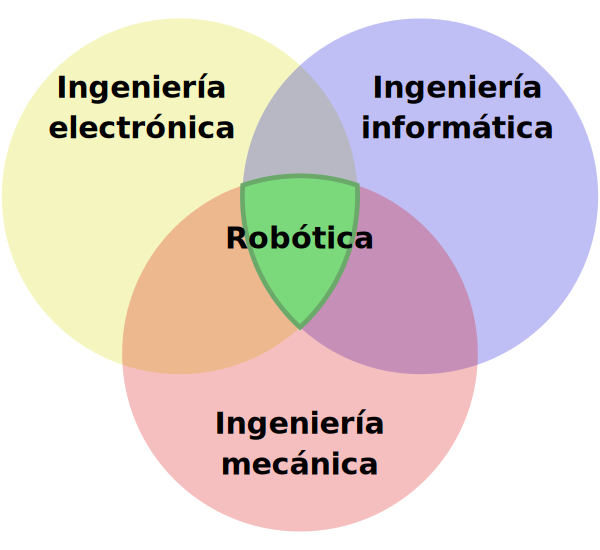
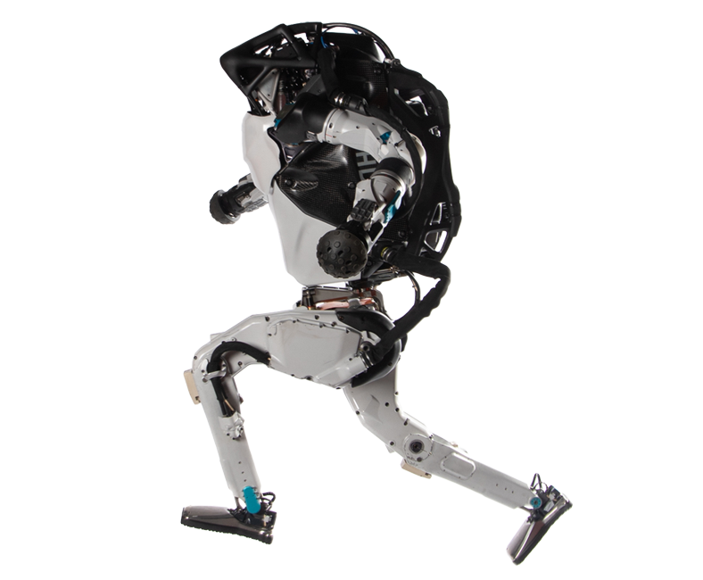
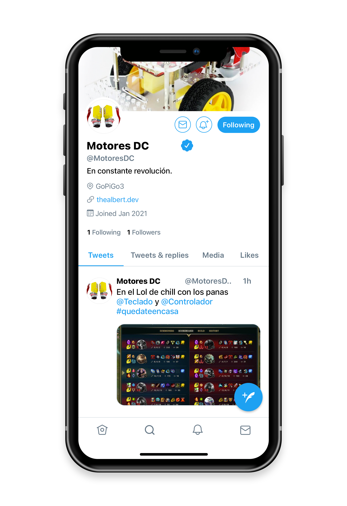
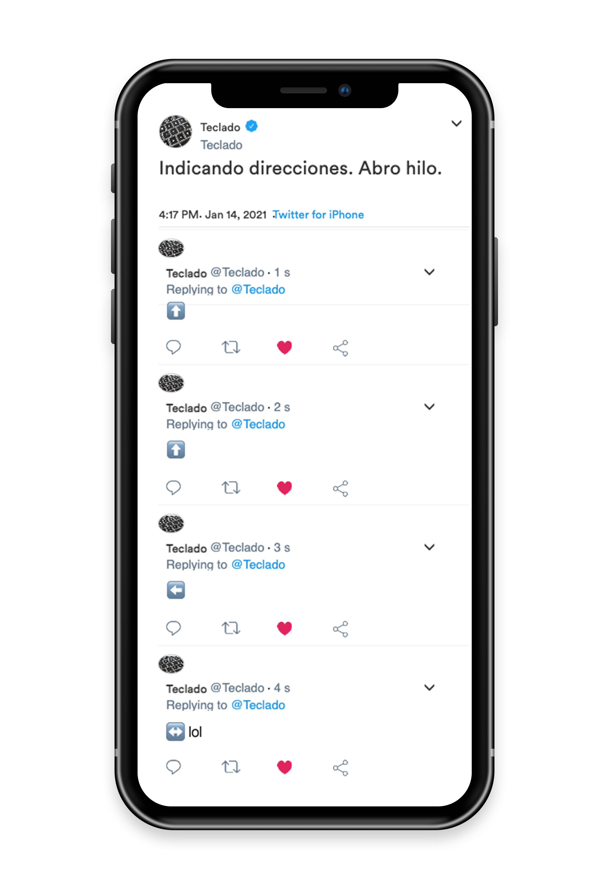
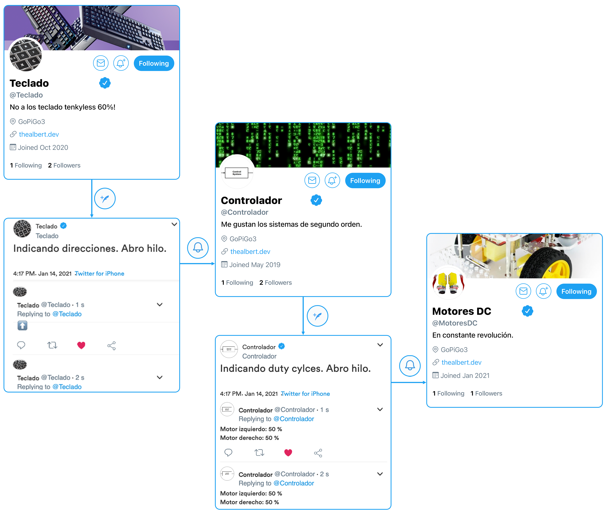
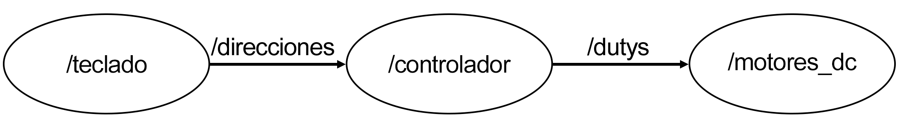

# Aprendiendo ROS con GoPiGo3

<blockquote><a rel="cc:attributionURL" property="dct:title" href="[https://github.com/Albert-Alvarez/ros-con-gopigo3](https://github.com/Albert-Alvarez/ros-con-gopigo3)">Aprendiendo ROS con GoPi</a> por <a rel="cc:attributionURL dct:creator" property="cc:attributionName" href="[https://thealbert.dev/](https://thealbert.dev/)">Albert Álvarez Carulla</a> se distribuye bajo una <a rel="license" href="[https://creativecommons.org/licenses/by-nd/4.0/deed.es](https://creativecommons.org/licenses/by-nd/4.0/deed.es)">Licencia Creative Commons Atribución-SinDerivadas 4.0 Internacional (CC BY-ND 4.0)</a>. </a></blockquote>

# Contenidos

- [Introducción](#)
- [Qué es ROS](#qué-es-ros)
- [El Twitter de los robots](#el-twitter-de-los-robots)
- [Objetivos](#objetivos)
- [Planificación](#planificación)
- [Proyecto](#proyecto)
- [Evaluación](#evaluación)
- [Dudas y cuestiones](#dudas-y-cuestiones)
- [Conclusiones](#conclusiones)

Un sistema robótico o robot es un sistema de por sí complejo. De hecho, **la robótica es la [sinergia](https://dle.rae.es/sinergia) de tres ingenierías** distintas: la **electrónica**, la **informática** y la **mecánica**. Para que un robot lleve a cabo su tarea correctamente, estos tres pilares deben trabajar coordinadamente para conseguir ese fin común. ¿Te imaginas tener que ser ingeniero electrónico, ingeniero informático e ingeniero mecánico para poder hacer un robot? Yo no me veo, vamos. Además, no habría espacio en la pared para colgar tanto título 😅 Es por ello que, **en proyectos de robótica, lo que impera es el trabajo en equipos multidisciplinares** donde diferentes miembros son ingenieros de las distintas ramas.

Aunque el trabajo de uno sea aportar en esos aspectos ligados a su rama de la ingeniería, sí que es necesario que todos los miembros del equipo multidisciplinar tengan un conocimiento mínimo del resto de ramas para poder mantener una comunicación intraequipo efectiva. Resumiendo, en robótica, aunque seas ingeniero electrónico, no irás muy lejos si no sabes qué es el estátor de un motor DC. Lo mismo le sucede a los ingenieros mecánicos, los cuáles no deben conocer los detalles de cómo implementarás los circuitos electrónicos del robot; pero en una conversación con él/ella, debe de entenderte cuando le digas que debes de cambiar el circuito porque el *duty cylce* de la señal PWM se está configurando mal.

Pese a todo esto, golpe de realidad. **Cuando empieces en la robótica no sabrás mucho o nada de las otras ramas** 😭 No te preocupes. **Es normal.** La **experiencia** es lo que te irá llevando a conocer los aspectos de las otras ingenierías que te son necesarios para llevar a cabo tu trabajo correctamente.

En estas sesiones con ROS, precisamente, lo que haremos será "inmiscuirnos" en los asuntos de los demás. De hecho, nos "inmiscuiremos" (valiente palabro) en aspectos de la ingeniería informática. Y es que **ROS es un *middleware*** que nos facilita el desarrollo de robots.

Que no nos engañen ("que nos digan la verdad"), ROS viene de las siglas *Robotics Operating System*, pero **no es un sistema operativo**. Una mala elección de palabras en el momento que se le puso nombre puede llevar a esta confusión. ~~Saldrá en el examen.~~

# Qué es ROS

Antes de ver qué es ROS y en qué consiste, vamos a ver primero **por qué lo necesitamos**. Para ello, imaginaros el siguiente robot.

Todos alguna vez lo hemos visto. Es el robot [Atlas de Boston Electronics](https://www.youtube.com/watch?v=_sBBaNYex3E). Este robot tiene 28 uniones hidráulicas y además una infinidad de sensores para analizar el terreno, para obtener la orientación, para monitorizar el par aplicado por los diferentes motores, etc. ¿Os imagináis hacer que cada uno de los sensores y actuadores puedan comunicarse entre sí sin errores o colisiones, dotarle de una capacidad computacional brutal para que pueda moverse por un terreno irregular y que además podamos monitorizarlo externamente desde un PC? Venga va, si a veces nos encallamos con un NACK en la comunicación I2C con un triste sensor de temperatura. ¡Hacer todo esto a bajo nivel sería una montaña de trabajo descomunal! 😱 Ya no entro en qué pasa si queremos hacer una actualización del robot y queremos añadir una serie de sensores y actuadores nuevos que deben de incorporarse a la comunicación ya existente. O por ejemplo, ¿qué ocurre si queremos simularlo todo antes de probar el robot?

.......

¿No ibas a proponer arrancar un sistema como este robot, potencialmente peligroso para aquellos que estén alrededor suyo, sin antes haberlo simulado? ¿A que no? Ya decía yo.

Bien, pues todos estos problemas son algunos de los que nos viene a resolver ROS. Pero, y ahora sí que toca hablar de ello, ¿qué es ROS?

**ROS** es un ***software*** que actúa como ***middleware*** entre los diferentes elementos que conforman un robot. ¿Qué es un *[middleware](https://es.wikipedia.org/wiki/Middleware)*? El propio nombre nos lo deja entrever... *middle*... en medio. Es un **[framework](https://es.wikipedia.org/wiki/Framework)** (iros quedando con los palabros) que sirve de **interfaz** entre los diferentes elementos de un robot para habilitar su **intercomunicación**. En ROS tenemos elementos/conceptos como nodos, *topics*, *packages*, etc. Per antes de ver esos conceptos, vamos a intentar hacer una analogía que nos permita entender qué hace ROS.

# El Twitter de los robots

Imaginemos que diferentes partes del robot han cobrado vida cual [Toy Story](https://es.wikipedia.org/wiki/Toy_Story) y que, además, tienen aires de *influencers* y tienen perfil en una red social como Twitter. Para estudiar una situación particular, aplicaremos este caso al robot con el que trabajaremos (GoPiGo3).

Primeramente, tenemos a los **usuarios** `@MotoresDC`, `@Teclado` y `@Controlador`. Estos, como usuarios, pueden **publicar Tweets** en la red social, como cualquier otro usuario. A su vez, estos pueden **seguir los Tweets** de otros usuarios.

Generación Z: — "¿En serio me vas a explicar cómo van las redes sociales?"

Vale, vale. No creo que haga falta que te describa mucho más de lo que se puede hacer en una red social... 😅

Cada **usuario tiene un fin o tarea** en su día a día: publicar algunos vídeos en YouTube, hacer algún directo en Twitch, mantener sus redes sociales, etc., y, como elementos de un robot, tienen tareas específicas. Por ejemplo, el usuario `@MotoresDC` se encarga de generar los [PWMs](https://es.wikipedia.org/wiki/Modulaci%C3%B3n_por_ancho_de_pulsos) que controlarán los motores, el usuario `@Teclado` se encarga de indicar a dónde se debe de dirigir el robot, y el usuario `@Controlador`, en función de lo que diga el usuario `@Teclado`, le dirá a al usuario `@MotoresDC` qué PWMs debe de fijar.

El usuario `@Teclado` se dedica a publicar Tweets con las teclas/flechas que se le pulsan generando de este modo un hilo.

Por otro lado, el usuario `@Controlador` sigue al usuario `@Teclado` y está pendiente de lo que va publicando en ese recién creado hilo. En función de lo que va leyendo del hilo, calcula qué valores de *duty cycle* corresponderían a cada motor del robot y los publica en su propio hilo.

Finalmente, tenemos al usuario `@MotoresDC` que sigue al usuario `@Controlador`. En función de los *duty cycles* que este último vaya publicando en su hilo, el usuario `@MotoresDC` generará los pertinentes PWMs para controlar los motores.

Al final, lo que tenemos es una red tal como esta.

Obviamente, nuestro robot no está formado por Ibais, AuronPlays, PaposMCs, ni nada por el estilo, sino que son partes del robot y la "red social" que los une es ROS.

La correspondencia entre el ejemplo y una implementación en ROS sería la siguiente:

- Los **usuarios** serían lo que en ROS se denominan **nodos**. Estos operan de manera independiente, están pendientes de lo que van publicando otros nodos y, a su vez, publican sus propias publicaciones. Cada nodo tiene un nombre único que lo identifica.
- A los **hilos** se les llama ***topics**.* Es donde los diferentes nodos publican o leen mensajes. Un nodo puede realizar dos acciones sobre un *topic*: o bien **publica** en él (añade más mensajes al *topic*) o bien se **suscribe** a él (está pendiente y lee todos los mensajes publicados en el *topic*). Cada *topic*  tiene un nombre único que lo identifica. Como en una red social, **más de un nodo puede tanto publicar como suscribirse a un mismo *topic**.*
- Cada una de las **publicaciones** hechas en un *topic* se les conoce como **mensaje**. **Los mensajes tienen definido un tipo.** De este modo, si vamos a publicar velocidades, publicaremos un mensaje de tipo "velocidad" y si, por ejemplo, publicamos un mensaje en el que indiquemos la posición en el espacio, utilizaremos un mensaje de tipo "posición geométrica". (Me he inventado los tipos, ya los veremos más adelante 😉).
- Luego, en las redes sociales solemos tener la opción de enviar DM o **mensajes directos**. Lo más parecido en ROS son los ***services**,* comúnmente utilizados para comunicaciones directas de pregunta/respuesta entre los diferentes nodos.
- También tendríamos la opción de **guardar los mensajes de un *topic***. Estos mensajes se guardan en bolsas o ***bags*** y son útiles, por ejemplo, para depurar el funcionamiento de un robot pudiendo tanto volver a observar como volver a replicar/publicar los mensajes previamente guardados.
- Por último, de manera transparente al usuario, en las redes sociales tenemos un **servidor** que se encarga de almacenar una lista con los usuarios registrados, los *topics* publicados, quién se ha suscrito a un *topic*, quién ha publicado uno nuevo,... Ese elemento/entidad que se encarga de gestionar las tareas básicas de mantenimiento en ROS se llama **master**. Se encarga de "apuntar" los nodos que se unen a la red ROS, los topics que publican cada uno y a los que se suscriben. De este modo, si un nodo quiere suscribirse a un *topic,* deberá de ir al master a preguntar si ese *topic* existe, quién lo ha creado, dónde puede encontrarlo, etc. **En toda red ROS siempre tiene que haber un master.**

En la versión 2.0 de ROS, la necesidad de un master es suprimida y la red es totalmente distribuida.

Con todo esto, la red anterior se convertiría en la siguiente red en ROS.

Otros detalles como *workspaces*, *packages* y demás, lo iremos viendo en las sesiones de prácticas.

# Objetivos

Durante estas sesiones prácticas con ROS, tendremos en mente la consecución de una serie de objetivos de tal modo que, al final de las sesiones, seamos capaces de:

- Comprender qué es ROS y qué problemas soluciona.
- Conocer los diferentes elementos que conforman una red ROS.
- Implementar nuestros propios *packages* en ROS.
- Utilizar/incorporar *packages* de terceros.
- Simular el comportamiento de un robot en Rviz/Gazebo.
- Desplegar un *package* de la simulación al mundo físico.
- Hacer uso de un [LIDAR](https://es.wikipedia.org/wiki/LIDAR) para escanear el entorno.
- Implementar un sistema de navegación autónomo de nivel  básico.
- Implementar un sistema de navegación autónomo de nivel básico-medio.
- Llevar a cabo un proyecto ROS en sus principales fases: diseño, desarrollo, simulación y despliegue.

# Planificación

Las prácticas están planificadas en **7 sesiones** de 2 + 2 horas cada una: **2 en clase** y **2 en casa** o de trabajo autónomo, [como todos sabemos](https://www.ub.edu/web/ub/es/estudis/oferta_formativa/graus/objectius_estructura/estructura/estructura.html). Todos conocemos las circunstancias especiales en las que nos encontramos y el "dónde" realizamos las prácticas puede variar **según evolucione la situación epidemiológica** (¿sesiones de 2 + 2 en casa?). En este aspecto, solo recomendarte que **estés atento a [las últimas noticias](https://www.ub.edu/web/ub/ca/universitat/coronavirus/)**, aunque, **ante cualquier cambio, te avisaríamos de inmediato**.

Las **prácticas** están **concebidas a modo *puzzle*** de tal modo que en **cada sesión** obtengas **una pieza** 🧩 de ese *puzzle*. Al final, se te pedirá un **proyecto** donde no verás nada nuevo y, "simplemente", deberás de demostrar tu nivel de integración de los conocimientos y habilidades **uniendo cada una de las diferentes piezas** 🧩 en un magnifico y estupendo *puzzle*/proyecto 😎

Cada sesión vendrá acompañada de un **cuestionario previo** que te permitirá ver si has comprendido la práctica **antes de empezar en clase/laboratorio**. Este cuestionario estará disponible durante los **primeros 5 minutos de cada sesión** y lo haremos **online en clase**. Además, una vez finalizada la sesión, no hará falta ningún informe y normalmente solo deberás de subir el *workspace* de la práctica que has hecho.

Las **prácticas** se desarrollan de manera **individual**, aunque cuando hagas la implementación física en el robot, este último lo compartirás con otros compañeros.

Sobre el proyecto, hablamos en el siguiente apartado.

# Proyecto

El **proyecto se realiza en grupo**. El número de integrantes por cada grupo depende de cuántos seamos y cuántos robots hayan disponibles, por lo que crearemos los grupos en clase. **El proyecto consistirá en llevar a cabo un proyecto en ROS de cabo a rabo**. El objetivo del proyecto es implementar un **sistema robótico en ROS** que, **de manera autónoma**, **mapee la estancia** en la que se encuentre para, posteriormente, poder **ir de un punto a otro** del mapa utilizando la **trayectoria más óptima** siempre **evitando cualquier obstáculo** en el camino. Cuando inciemos el proyecto, te indicaremos otro objetivos de segundo orden. 

Este proyecto **debe de incluir las fases: diseño, desarrollo, simulación y despliegue**.

Como **entregables** estarán el ***workspace* del proyecto** y un **video de presentación** de **no más de 10 minutos** con el trabajo realizado y una demostración. Como veis, al tratarse de un vídeo, la presentación es asíncrona, por lo que no habrá turno de preguntas... **PERO, pero,** peeeero, en función de cómo se vayan desarrollando las prácticas y del trabajo realizado, **me reservo el derecho de concertar una entrevista contigo o tus compañeros durante la clase para comprobar que todos los integrantes del grupo han trabajado por igual y todos habéis integrado los conocimientos y habilidades que se requieren para superar estas prácticas**. Estaré ojo avizor... 🕵️‍♂️

En clase os daremos más info sobre el proyecto 😉

# Evaluación

Al meollo del asunto, a por lo que todos estamos aquí (espero que no... 😭). La evaluación de **estas sesiones prácticas con ROS** (no lo confundas con la evaluación global de la asignatura) está establecida del siguiente modo:

- Sesiones prácticas: Cuestionarios previos 50% + Entrega del *workspace* 50% 
- Proyecto: 100%

Además, se le aplican una serie de requisitos a esta tabla (**recordemos que es la evaluación de las sesiones con ROS, no de la asignatura**). **No cumplirlos comportará un "no evaluado" de ROS**, pero estoy más que seguro que nadie incumplirá estos requisitos tan básicos. Yo de ti ni me preocuparía, pero, por si acaso, son estos:

- **La asistencia a las prácticas de laboratorio es obligatoria, ya sea presencial o virtual.** ¿Por qué? Porque las sesiones prácticas tienen el objetivo de desarrollar tus competencias ligadas a habilidades. A diferencia de las competencias de conocimientos o saberes, las competencias de habilidades solo se pueden evaluar viendo como las llevas a cabo (en este caso, en el laboratorio). Típico ejemplo: no puedo decir que sabes nadar si no te he visto nadar todos los días en las piscina (y no vale que me hagas un examen escrito sobre natación... 😑).
- **Todos los elementos de evaluación deben de superarse con una nota mínima de 4.** ¿Por qué? Te puede salir un proyecto de 10 que si no demuestras que sabes qué es un nodo en ROS, ¿de qué te sirve? El mínimo de 4 corresponde a saber lo más mínimo, mínimo, mínimo que se puede pedir de ROS. Casi con poner el nombre bien ya tienes un 3,5 😅
- **No está permitido copiar o plagiar indistintamente de la fuente.** ¡Pero sí se te anima a investigar y referenciar debidamente, y a debatir e intercambiar ideas y opiniones con otros compañeros! La línea es fina... pero muy clara. ¿Por qué? ¿Hace falta decir el porqué? ... Pues porque te evaluó a ti, no a tu compañero o compañera ni al usuario clavelitoRobotico77 de GitHub. Pero sin embargo sí que quiero que hables con tus compañeros y les preguntes cómo han llevado a cabo sus desarrollos, les preguntes dudas, que consultes a clavelitoRobotico77 cómo hacer esa función que tanto te cuesta, etc., siempre y cuando no hagas un *copy/paste* y referencies correctamente las fuentes que utilices.

Cualquier duda sobre la evaluación la podemos comentar en clase 👨‍🏫

# Dudas y cuestiones

Cualquier **duda** o problema durante estas sesiones (¡o cualquier cosa que haya que corregir en los guiones!), **crea un *issue* en el siguiente [enlace](https://github.com/Albert-Alvarez/ros-gopigo3/issues)**. Deberás de **crearte un usuario en [GitHub](https://github.com/).** La idea es que todo quede centralizado aquí y futuros estudiantes encuentren aquí las dudas y soluciones que han tenido compañeros de cursos anteriores. Esto no se puede hacer en Moodle tal y como está configurado ahora mismo puesto que los mensajes del Foro no sobreviven de un año para el otro 😥

# Conclusiones

Pues en este primer documento de presentación hemos visto algo muy importante: **qué es ROS**, algunos de los **problemas que resuelve** y **qué elementos conforman** una red ROS. También hemos presentado las diferentes **sesiones de prácticas** y cómo las **planificaremos**. Hemos visto una pincelada de lo que será el **proyecto**. Y finalmente, hemos echado un ojo a lo que será la **evaluación de las prácticas de ROS**.

Con esto, ya puedes ir a la [primera sesión](ROS%20con%20GoPiGo3%20-%20S1.md) y leerte el guion antes de venir a clase **para poder hacer el cuestionario online nada más llegues a clase**. Además, **en la primera sesión instalaremos una serie de *software***, por lo que **es vital** que leas el guion con antelación y **que traigas todo descargado (que no instalado) de casa**.
