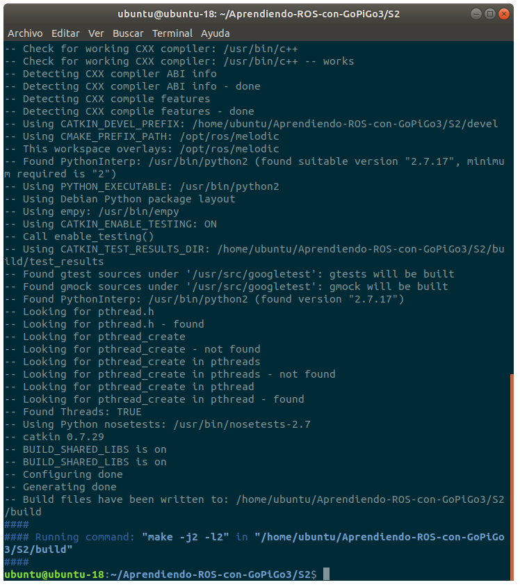

# S2 — Creación de un package/nodo: publicación y suscripción a topics

<blockquote><a rel="cc:attributionURL" property="dct:title" href="https://github.com/Albert-Alvarez/ros-gopigo3">S2 - Creación de un package/nodo: publicación y suscripción a topics</a> por <a rel="cc:attributionURL dct:creator" property="cc:attributionName" href="https://thealbert.dev/">Albert Álvarez Carulla</a> se distribuye bajo una <a rel="license" href="https://creativecommons.org/licenses/by-nd/4.0/deed.es">Licencia Creative Commons Atribución-SinDerivadas 4.0 Internacional (CC BY-ND 4.0)</a>.<br /></a></blockquote>

En la anterior sesión vimos cómo hacer correr el master, cómo ejecutar nodos y cómo ver los *topics* disponibles, así como ver cómo obtener información sobre ellos y sus mensajes. Finalmente, vimos cómo obtener un gráfico de la red ROSM una utilidad que nos será de gran ayuda para monitorizar y depurar nuestros proyectos. En esta sesión, vamos a crear por primera vez un *package* propio. Este *package* contendrá dos nodos (recordemos que los nodos se agrupan en *packages*): un *publisher* y un *suscriber*.

ROS acepta [múltiples lenguajes de programación](http://wiki.ros.org/ROS/Introduction) para su desarrollo: [Python](http://wiki.ros.org/rospy), [C++](http://wiki.ros.org/roscpp), [Lisp](http://wiki.ros.org/roslisp) y versiones experimentales en Java y Lua. También podéis encontrar ROS usado en otros lenguajes de programación, como [LabVIEW](https://www.ni.com/ro-ro/innovations/case-studies/19/introducing-labview-and-the-robot-operating-system-ros.html), pero en el fondo no dejan de ser llamamientos a APIs desarrolladas en los lenguajes anteriores. En nuestro caso, desarrollaremos los nodos en Python. ¿Por qué Python? Pues porque ya lo conocemos y es mucho más fácil que programar en C++. Además, es mucho más "visible" la comunidad dedicada al desarrollo en Python, por lo que, si encuentras dificultades durante las prácticas o proyecto, es mucho más fácil que encuentres información.

Para desarrollar ese *package*, primeramente configuraremos nuestro *workspace* en ROS. En ROS, un *workspace* es básicamente la carpeta que contendrá nuestro proyecto, por lo que podemos entender que, en ROS, hablar de un *workspace* es lo mismo que hablar de un proyecto. Veremos que ese *workspace* debe de seguir una estructura de directorios que veremos a continuación. En uno de esos directorios crearemos nuestro *package* para, seguidamente, compilarlo.

Como hemos comentado al principio, crearemos dos nodos en este *package*. Primeramente, los ejecutaremos como hicimos en la sesión anterior: `rosrun`. Pero aprovecharemos para ver cómo lanzar más de un nodo simultáneamente y que, a su vez, se lance el master automáticamente. ¡Nos dará la vida esta funcionalidad!

Arremángate, ¡*allévamos*!

# Contenidos

- [Introducción](#s2--creación-de-un-packagenodo-publicación-y-suscripción-a-topics)
- [Contenidos](#contenidos)
- [Objetivos](#objetivos)
- [Procedimiento](#procedimiento)
  - [Preparar un *workspace*](#preparar-un-workspace)
  - [Compilación del *workspace*](#compilación-del-workspace)
  - [Instalación de *packages*](#instalación-de-packages)
  - [Creación de un *package*](#creación-de-un-package)
  - [Creación de un nodo *publisher*](#creación-de-un-nodo-publisher)
  - [Creación de un nodo *subscriber*](#creación-de-un-nodo-subscriber)
  - [Creación de *launch files*](#creación-de-launch-files)
- [Reto](#reto)
- [Evaluación](#evaluación)
- [Conclusiones](#conclusiones)

# Objetivos

- Preparar *workspace* de ROS.
- Compilación de un *workspace*.
- Instalar *packages* de nuestro *workspace*.
- Crear *package*.
- Crear un nodo.
- Publicar en un *topic* desde Python.
- Suscribirse a un *topic* desde Python.
- Crear y lanzar un *launch file*.

# Procedimiento

## Preparar un *workspace*

Vamos a crear nuestra carpeta para desarrollar nuestro proyecto en ROS; es decir, nuestro *workspace*. Te daré la indicaciones a modo de comandos en el terminal. Si algún comando no te acuerdas cómo funciona o qué hace, no dudes en echar un ojo al [guión/chuleta de la sesión anterior](\ROS%20con%20GoPiGo3%20-%20S1.md) 😉

En nuestra máquina virtual (VM), abrimos un nuevo terminal. Por defecto, nada más abrir n terminal recién, estaremos en nuestro *home*. Allí creamos una carpeta donde colocaremos todos los *workspaces* que crearemos durante las prácticas de ROS. Esa carpeta se llamará `Aprendiendo-ROS-con-GoPiGo3`:

```bash
mkdir Aprendiendo-ROS-con-GoPiGo3
```

**IMPORTANTE:** Puede ser tentador copiar/pegar código o comandos. No se puede comprobar (o sí... 😈) si lo has hecho o no, ni tampoco te puedo obligar, pero es altamente recomendable que siempre intentes escribir todo aquello que programes. Solo así entenderás qué vas haciendo. Ahora empezamos suave/fácil, pero más adelante la cosa se complicará y echarás de menos no haberlo hecho así desde el principio. Es una recomendación para tu propio interés 😉

Creada la carpeta, entramos y allí creamos una carpeta llamada `S2` que será el *workspace* de esta sesión. Cuando vayas a entrar a la carpeta `Aprendiendo-ROS-con-GoPiGo3`, por favor, no lo escribas todo 😖 Escribe. por ejemplo, `Apre` y pulsa <kbd>TAB</kbd>. El terminal te autocompletará el nombre.

```bash
cd Aprendiendo-ROS-con-GoPiGo3
mkdir S2
```

Dentro de la carpeta `S2`, creamos una carpeta que se llame `src`.

```bash
mkdir src
```

Hecho esto, en este instante tenemos la siguiente estructura de directorios:

```
~/Aprendiendo-ROS-con-GoPiGo3/
└── S2
    └── src
```

La estructura de directorios de `S2` es la estructura básica de un *workspace* en ROS. La carpeta `S2` es la **carpeta raíz** del *workspace*, mientras que la **carpeta `src` contendrá los diferentes *packages*** de nuestro proyecto. Carpetas adicionales se nos crearán bajo la carpeta `S2`; ya las veremos, pero estas se nos generan automáticamente al compilar el *workspace*.

Importante que te quedes con cuál es la carpeta raíz de un *workspace* en ROS. Es en esa carpeta donde se tienen que ejecutar cierto comandos tan importantes como el compilar. Si no lo haces ahí, ¡te saltarán errores!

## Compilación del *workspace*

No tenemos ningún *package*, pero es no nos impide que podamos compilar nuestro *workspace*. Para ello, se utiliza [catkin](http://wiki.ros.org/catkin/conceptual_overview). Básicamente, catkin es una herramienta que configura la compilación de nuestro *workspace* y lanza su compilación. Todo de manera automática 😎

El comando para compilar un *workspace* es:

```bash
catkin_make
```

**Super-importante.** Este comando debe de **lanzarse estando en la carpeta raíz de un *workspace*** de ROS. Si lo haces en otra carpeta (dentro de la carpeta `src`, por ejemplo) o lo haces fuera de un *workspace* de ROS (cualquier carpeta que no tenga dentro una carpeta `src`), dará error.

Una vez lanzado, se iniciará la compilación y el terminal nos dará información sobre cómo ha ido.



Es muy importante que te acostumbres a leer los logs que te da el terminal. Te informarán sobre errores y sus causas. Esto te permitirá solucionar errores más rápidamente. Además, el día de mañana en el trabajo, ¡no habrá un profe a quien preguntar! Y no irás al jefe a decirle "Me da error. ¿Qué hago?" 😅 Coge el hábito de mirar el log, ver si hay algún error y tratar de solucionarlo. ¡Muchas veces hasta los logs te dan la propia solución!

Como he comentado antes, ahora en nuestro *workspace* se nos han creado dos carpetas, `build` y `devel`. Estas contienen nuestros archivos de compilación (`[build](https://wiki.ros.org/catkin/workspaces#Build_Space)`) y nuestro proyecto compilado listo para ser instalado (`[devel](https://wiki.ros.org/catkin/workspaces#Development_.28Devel.29_Space)`).

Un aspecto importante de ROS: la **compilación es acumulativa**. ¿Qué quiere decir? Pues que si un *package* ya ha sido compilado anteriormente y no se ha modificado, al hacer un `catkin_make`, este *package* no volverá a ser compilado. Catkin sabe qué *packages* ya han sido compilados mirando la carpeta `build`, por lo que si quieres volver a compilar un *package*, simplemente elimina las carpeta `build` y `devel`.

```bash
rm -rf build/ devel/
```

¿Cuándo vas a querer volver a compilar un *package* ya compilado? Pues imagínate que alguien te pasa su *workspace* y no toma la precaución de enviarte el *workspace* sin las carpetas `build` y `devel`. En esas carpetas estarán los archivos compilados, pero con las rutas de SU ordenador. Es decir, al instalar los *packages,* no encontrará tus archivos porque estará buscando en rutas erróneas. ¿Solución? Eliminar las carpetas `build` y `devel`` y volver a compilar. Otra moraleja, cuando compartas tus *workspaces*/proyectos en ROS, no envies las carpetas `build` y `devel`.

## Instalación de *packages*

Acabamos de compilar un *workspace* sin *packages*. Ahora vamos a instalar los *packages* resultantes de la compilación. Es decir, vamos a instalar aire 😅

Estamos haciendo esto para ver cómo compilar e instalar los *packages* de un *workspace* de ROS. Obviamente, no tiene absolutamente ningún sentido compilar e instalar "nada" 😑

Al instalar los *packages*, estos y sus nodos estarán disponibles en el terminal. Si no los instalamos, el terminal nos dirá que no los encuentra.

**IMPORTANTE:** la instalación es para el terminal desde donde realicemos la instalación. Si abrimos otro terminal (nueva ventana o pestaña), hará falta volver a hacer la instalación para que los *packages* y sus nodos estén disponibles en este nuevo terminal.

Dentro de la carpeta `devel`, catkin nos ha creado un script, llamado `setup.sh`, con los comandos necesarios para instalar los *packages* del *workspace* compilado. Simplemente, debemos de ejecutar ese script. [¿Te acuerdas cómo?](https://www.notion.so/S1-Configuraci-n-de-nuestro-ordenador-operaciones-b-sicas-en-Linux-y-super-simulaci-n-de-una-tort-139f3a330d9642a58d98c034b7b24cc2) Desde la carpeta raíz del *workspace*, ejecutamos:

```bash
source devel/setup.sh
```

En principio, no nos debería de salir nada, indicando que la instalación se ha realizado correctamente.

## Creación de un *package*

Bueeeno. Ahora sí. Vamos a crear un *package* que podamos compilar. Para crear un *package* nos metemos dentro de la carpeta `src`.

```bash
cd src
```

Ahí, vamos a crear un *package* que se llamará `mi-primer-package` (original, ¿verdad? 😅). Aún no lo ejecutes, pero crearíamos el *package* con el siguiente comando:

```bash
catkin_create_pkg mi-primer-package
```

Ese *package* lo desarrollaremos con Python y en él tendremos nodos que publiquen y se suscriban a *topics*. Eso quiere decir, que enviaremos/leeremos mensajes. Estos mensajes, a su vez, tendrán tipos asociados. Todo esto significa que, nuestro *package*, tendrá una serie de dependencias:

- [rospy](http://wiki.ros.org/rospy): librería utilizada en Python para operar con ROS
- [std_msgs](http://wiki.ros.org/std_msgs): librería que contiene las definiciones de tipos de mensajes estándares o básicos.

Debemos de indicar esas dependencias en el momento de crear el *package*. Si nos las dejamos, o nos damos cuenta más adelante que necesitamos añadir esas dependencias, no hay problema. Podremos hacerlo más adelante. Solo [hay que modificar un archivo y no es difícil](http://wiki.ros.org/rosdep/Tutorials/How%20to%20add%20a%20system%20dependency), pero no es tan directo como que te lo haga catkin de manera automática al crear un *package*.

Las dependencias se adjuntan directamente al comando anterior. El comando que debemos ejecutar finalmente es:

```bash
catkin_create_pkg mi-primer-package rospy std_msgs
```


Se nos crea el *package*. Una nueva carpeta llamada `mi-primer-package` aparecerá dentro de la carpeta `src`.  Recuerda que puedes ver las carpetas y archivos en la actual carpeta mediante el comando `ls` o, mejor aún, `ls -l`. Además, se nos "anima" a modificar los valores de un archivo llamado `package.xm` dentro de nuestro *package*. Abramos ese `package.xml`. Lo abriremos con `gedit`, el "Bloc de Notas" de Ubuntu.

```bash
cd mi-primer-package
gedit package.xml
```

El archivo tiene la siguiente pinta:

```xml
<?xml version="1.0"?>
<package format="2">
  <name>mi-primer-package</name>
  <version>0.0.0</version>
  <description>The mi-primer-package package</description>

  <!-- One maintainer tag required, multiple allowed, one person per tag -->
  <!-- Example:  -->
  <!-- <maintainer email="jane.doe@example.com">Jane Doe</maintainer> -->
  <maintainer email="ubuntu@todo.todo">ubuntu</maintainer>

  <!-- One license tag required, multiple allowed, one license per tag -->
  <!-- Commonly used license strings: -->
  <!--   BSD, MIT, Boost Software License, GPLv2, GPLv3, LGPLv2.1, LGPLv3 -->
  <license>TODO</license>

  <!-- Url tags are optional, but multiple are allowed, one per tag -->
  <!-- Optional attribute type can be: website, bugtracker, or repository -->
  <!-- Example: -->
  <!-- <url type="website">http://wiki.ros.org/mi-primer-package</url> -->

  <!-- Author tags are optional, multiple are allowed, one per tag -->
  <!-- Authors do not have to be maintainers, but could be -->
  <!-- Example: -->
  <!-- <author email="jane.doe@example.com">Jane Doe</author> -->

  <!-- The *depend tags are used to specify dependencies -->
  <!-- Dependencies can be catkin packages or system dependencies -->
  <!-- Examples: -->
  <!-- Use depend as a shortcut for packages that are both build and exec dependencies -->
  <!--   <depend>roscpp</depend> -->
  <!--   Note that this is equivalent to the following: -->
  <!--   <build_depend>roscpp</build_depend> -->
  <!--   <exec_depend>roscpp</exec_depend> -->
  <!-- Use build_depend for packages you need at compile time: -->
  <!--   <build_depend>message_generation</build_depend> -->
  <!-- Use build_export_depend for packages you need in order to build against this package: -->
  <!--   <build_export_depend>message_generation</build_export_depend> -->
  <!-- Use buildtool_depend for build tool packages: -->
  <!--   <buildtool_depend>catkin</buildtool_depend> -->
  <!-- Use exec_depend for packages you need at runtime: -->
  <!--   <exec_depend>message_runtime</exec_depend> -->
  <!-- Use test_depend for packages you need only for testing: -->
  <!--   <test_depend>gtest</test_depend> -->
  <!-- Use doc_depend for packages you need only for building documentation: -->
  <!--   <doc_depend>doxygen</doc_depend> -->
  <buildtool_depend>catkin</buildtool_depend>
  <build_depend>rospy</build_depend>
  <build_depend>std_msgs</build_depend>
  <build_export_depend>rospy</build_export_depend>
  <build_export_depend>std_msgs</build_export_depend>
  <exec_depend>rospy</exec_depend>
  <exec_depend>std_msgs</exec_depend>

  <!-- The export tag contains other, unspecified, tags -->
  <export>
    <!-- Other tools can request additional information be placed here -->

  </export>
</package>
```

Básicamente, consiste en un [archivo que contiene información o metadatos sobre el *package*](http://wiki.ros.org/catkin/package.xml): nombre, descripción, autor, correo de contacto,... Lo interesante esta al final del todo, donde podemos ver que rospy y std_msgs se han añadido como dependencias.

Para este ejemplo no hace falta que modifiquemos nada, pero si es interesante que modifiquéis esos datos en *packages* vuestros como el del proyecto final... Ahí lo dejo... 🙄

Cerramos gedit (el terminal queda bloqueado hasta que lo cerremos).

## Creación de un nodo *publisher*

Para crear un nodo, nos vamos a la carpeta de nuestro *package* y ahí creamos una carpeta que se llame `scripts`:

```bash
mkdir scripts
```

Ahí colocaremos nuestros archivos Python. En el nodo que desarrollaremos, crearemos un *topic* llamado `/chat` y en él publicaremos mensajes de tipo texto (std_msgs/String).

Antes de meternos en código, un breve refresco de la pinta que debe de tener nuestro *workspace*:

```
~/Aprendiendo-ROS-con-GoPiGo3/
└── S2
    ├── build
    ├── devel
    └── src
        └── mi-primer-package
            ├── scripts
            └── src
```

Ahora sí, creamos el archivo Python con gedit:

```bash
cd scripts
gedit mi-publisher.py
```

`[mi-publisher.py](http://mi-publisher.py)` es el nombre que le damos al nodo.

Pondremos el siguiente código en el archivo. Os explico/describo el código directamente en los comentarios:

```python
#!/usr/bin/env python

# Importamos la libreria rospy.
import rospy

# Importamos la definicion para los mensajes tipo texto.
from std_msgs.msg import String 

# Creamos un topic y almacenamos su referencia en una variable para poder
# usarlo mas adelante.
pub = rospy.Publisher('/chat', String, queue_size=10)

# Le damos un nombre al nodo. Puede ser distinto al nombre del archivo.
rospy.init_node('mi-publisher')

# Indicamos la frecuencia de operacion deseada para nuestro nodo.
r = rospy.Rate(10) # 10hz

# Operamos mientras no se apague/cierre el nodo (CTRL+C).
while not rospy.is_shutdown():

    # Publicamos "Hola, Mundo".
    pub.publish("Hola, Mundo")

    # Esperamos el tiempo necesario para cumplir con la frecuencia de
    # operacion configurada.
    r.sleep()
```

La primera línea no es un comentario cualquiera. Es un [shebang](https://en.wikipedia.org/wiki/Shebang_%28Unix%29) y, a grandes rasgos, le dice a ROS qué interprete debe de utilizar.

Guardamos y cerramos gedit.

Nos vamos al directorio raíz del *workspace* para compilar. Acuérdate que para subir una carpeta, utilizamos:

```bash
cd ..
```

Una vez en la carpeta raíz `S2`, compilamos:

```bash
catkin_make
```


Se nos indica que se ha encontrado un *package* (el nuestro) y se ha compilado.

Vamos a ejecutar el nodo que acabamos de compilar:

```bash
rosrun mi-primer-package mi-publisher.py
```


Ups... 😱 ¿Te acuerda lo de leer los logs del terminal? Pues a ello. El terminal nos está diciendo que no encuentra el archivo de nuestro nodo porque no está o no es ejecutable (no es ejecutable = no tiene permisos de ejecución). Vamos a ver qué permisos tiene nuestro archivo:

```bash
cd src/mi-primer-package/scripts/
ls -l
```


Pues efectivamente. No tiene permisos de ejecución. Vamos a dárselos:

```bash
sudo chmod u+x mi-publisher.py
```

Comprobamos ahora.


Y volvemos a probar de ejecutar en el directorio raiz:

```bash
rosrun mi-primer-package mi-publisher.py
```


Otro error... Madre mía... 🙄 Pero el log nos vuelve a decir otra vez cuál es el problema: no encuentra el master. No hemos iniciado roscore.

Paramos el nodo con <kbd>CTRL</kbd>+<kbd>C</kbd>. Abrimos una pestaña nueva en el terminal y ejecutamos:

```bash
roscore
```

Volvemos al terminal anterior y volvemos a ejecutar:

```bash
rosrun mi-primer-package mi-publisher.py
```


Todo funcionando 😊

...

...

"Ui, sí... Que emocionante... ¡Pero si no sale nada!"

*Keep calm and breathe deep*. Abre una pestaña nueva en el terminal y mira qué *topics* existen:

```bash
rostopic list
```


Ahí está nuestro *topic*. Vamos a ver información sobre él:

```bash
rostopic info /chat
```


Vemos que el tipo es el correcto y que el *publisher* es el esperado. También vemos que no hay nadie suscrito (como en mis redes sociales 😭).

Ahora vamos a ver qué mensajes están publicándose en él:

```bash
rostopic echo /chat
```


Ahí tenemos los mensajes que está publicando nuestro nodo 🥳

Tristemente... no hay nadie que se haya suscrito y lo lea... 😔 ¡Vamos a crear un nodo que se suscriba y lea esos mensajes!

## Creación de un nodo *subscriber*

Primero, puedes detener el `rostopic echo` que tienes corriendo en el terminal. Después, como con el *publisher*, vamos a crear el archivo de nuestro nuevo nodo en la carpeta `scripts` de nuestro *package*. Esta vez lo llamaremos... `mi-subscriber.py`:

```bash
cd src/mi-primer-package/scripts/
gedit mi-subscriber.py
```

Haremos que este nodo se suscriba al *topic* `/chat` y muestre los mensajes por terminal. Ponemos el siguiente código que comento/describo:

```python
#!/usr/bin/env python

# Importamos la libreria rospy.
import rospy

# Importamos la definicion para los mensajes tipo texto.
from std_msgs.msg import String

# Creamos una funcion que ejecutaremos cada vez que recibamos un mensaje nuevo.
def callback(data):
    # Mostramos por terminal el mensaje recibido.
    # Podemos dar colores o comportamientos especiales. Muy util para depurar
    # nodos. Mas info aqui: http://wiki.ros.org/rospy/Overview/Logging
    rospy.loginfo("Mensaje recibido: %s", data.data)

# Le damos un nombre al nodo. Puede ser distinto al nombre del archivo.
rospy.init_node("mi-subscriber")

# Nos suscribimos al topic chat indicando el tipo de mensaje que esperamos en
# el y la funcion a ejecutar cada vez que recibamos un mensaje nuevo.
rospy.Subscriber("chat", String, callback)

# Con spin(), simplemente dejamos suspendida la operacion del nodo hasta que se
# detenga o lo detengamos (CTRL C). Aunque se suspenda el nodo, este sigue
# activo y atiende eventos.
rospy.spin()
```

Guarda, cierra y ¡no olvides darle permisos de ejecución!

En el terminal, ejecutamos el nodo:

```bash
rosrun mi-primer-package mi-subscriber.py
```


Según el terminal que hayas utilizado, te habrá salido esto. Eso quiere decir que en este terminal no has hecho la instalación (`source`) del *package* y por eso no lo encuentra. Ves al directorio raíz del *workspace*, ejecuta el siguiente comando y vuelve a probar:

```bash
source devel/setup.sh
```


Ahora sí. Si no es que has cerrado los otros terminales o se ha detenido la ejecución de los otros nodos (master y mi-publisher), deberías estar viendo por terminal los mensajes recibidos. *Well done*! 🥳

En un terminal nuevo, ejecuta el comando `rqt_graph` y échale un vistazo a qué pinta tiene la red ROS. Tiene que tener una pinta tal que así:

<p align="center">

</p>

Una curiosidad. Abre un nuevo terminal y ejecuta `rostopic echo /chat`. Deberías de ver los mensajes del *topic*. ¿Qué pinta tiene ahora el rq_graph?

<p align="center">

</p>

Nos ha aparecido un nuevo nodo con un nombre rarísimo (seguramente diferente al de la imagen) que también está suscrito al *topic* `/chat`. ¿Te imaginas quién es?

Efectivamente. Es el terminal en el que estás corriendo `rostopic echo`, así que si algún día te aparece un nodo "raro" en el rqt_graph, comprueba que no tengas un terminal por ahí publicando o leyendo *topics.*

Para l@s avispad@s. Te habrás dado cuenta que no hemos hecho `catkin_make` aún cuando estamos modificando el código Python. Estos es porque Pyhton es un lenguaje interpretado, no compilado. Es decir, en la carpeta `devel` hay enlaces que apuntan directamente a tus archivos Python y cualquier modificación que hagas en ellos se reflejará en el *package* instalado. No ocurre lo mismo con lenguajes que necesitan ser compilados antes de usarse (C++). De igual modo, sí que hay que hacer `catkin_make` cuando incorporemos o eliminemos archivos Python para que esos enlaces se actualicen.

## Creación de *launch files*

Antes que nada, veamos un "problema". Si lo has cerrado todos los terminales, no pasa nada. Los íbamos a cerrar igualmente. Pero, ¿cuántos terminales tenías abierto para correr un proyecto super-sencillo?

- Terminal roscore.
- Terminal mi-publisher.
- Terminal mi-subscriber.
- Otros: rostopic, modificar programas, modificar permisos, etc.

Como ves, no es muy escalable utilizar un terminal por nodo. Aquí solo tenemos dos, pero en una aplicación real podemos tener incontables nodos. ¿No estaría bien lanzar todos a la vez desde un solo terminal? ¿No estaría bien, también, que de manera automática se inicia el roscore? Pues sí. Estaría muy bien. Para eso están los *[launch files](http://wiki.ros.org/roslaunch)*.

Los *launch files* no son más que archivos XML que lanzan todos los nodos indicados en su contenido y que, además, lanza roscore si no está corriendo Si ya está corriendo, no lo lanza.

Vamos a crear un *launch file*. Para ello, primeramente detenemos los procesos de los diferentes terminales (<kbd>CTRL</kbd>+<kbd>C</kbd>) y cerramos todos los terminales menos uno. A continuación, creamos una carpeta llamada `launch` en el directorio de nuestro *package*:

```bash
cd src/mi-primer-package/
mkdir launch
```

Entramos en la carpeta y, con gedit, creamos un fichero llamado `mi-launch-file.launch`:

```bash
cd launch
gedit mi-launch-file.launch
```

Como con el caso de los ficheros Python, añadid el siguiente código que os comento:

```xml
<!-- Como en HTML, los bloques de codigo se abren y cierran con etiquetas
     de marcado. -->
<launch>
        <!-- Con la etiqueta node, se indica que nodo se quiere iniciar. Los atributos
             indicados son los minimos para operar. http://wiki.ros.org/roslaunch/XML/node -->
        <node name="mi-publisher" pkg="mi-primer-package" type="mi-publisher.py" />
	
        <!-- Aqui, ademas, incorporamos el atributo output para indicar que queremos que
             sea este el nodo que queremos ver por terminal. Solo hay un terminal y varios
             nodos. Hay que escoger. -->
        <node name="mi-subscriber" pkg="mi-primer-package" type="mi-subscriber.py" output="screen" />
</launch>
```

No hace falta indicar nada sobre roscore. El *launch file* se ocupa por nosotros. Guardamos y cerramos.

Para lanzar el *launch file*, ejecutamos:

```bash
roslaunch mi-primer-package mi-launch-file.launch
```

Tras el mensaje que nos ha perseguido toda la sesión de que no le gusta los nombre que hemos puesto 😅, te debería de aparecer los mensajes recibidos por el nodo mi-subscriber, indicando que todos los nodos han arrancado correctamente. Comprueba que es así mediante el comando `rostopic` y el rqt_graph.

Si te ha aparecido cualquier error, comprueba que tengas compilado tu *workspace* (`catkin_make`) e instalado el *package* (`source`). Elimina las carpeta `build` y `devel` (`rm -rf build/ devel/`) antes e compilar, si hace falta.

Si todo te ha funcionado, ¡enhorabuena! Ya sabes crear nodos ROS en Python 😉

# Reto

Ahora es el momento que me demuestres que has entendido lo que hemos ido haciendo 👩‍🎓 Para ello, crea tu propio `workspace` llamado `S2_Reto`. En él, crea un *package* llamado `ping-pong`. En ese *package* crea dos nodos: uno llamado `ping` y el otro llamado `pong`. Ambos serán *suscribers* y *publishers* a la vez.

El nodo ping creará un *topic* llamado `/raqueta1` y en el publicará el texto (std_msgs) "ping". También se suscribirá a un *topic* llamado `/raqueta2`. El nodo pong se sucribirá al *topic* `/raqueta1` y publcará "pong" cada vez que reciba un "ping" en un *topic* llamado `/raqueta1`.

El nodo ping volverá a publicar un "ping" cuando reciba un "pong". Así todo el rato.

<p align="center">

</p>

Por último, crea un *launch file* donde todo se inicie automáticamente y se muestre la salida (`rospy.loginfo`) de cualquiera de los dos nodos.

Apunte **importante**. Puede que se dé el siguiente caso (puede no; se dará):

1. Ping envía "ping".
2. Pong aún no ha arrancado y se pierde el mensaje.
3. Pong acaba de arrancar, pero no envía nada porque no ha recibido ningún mensaje.
4. Ping no envía nada porque no recibe ningún mensaje de pong.
5. Se hace el silencio entre ping y pong...

Así que, básicamente, haz que ping envié su mensaje cada 1 s hasta que pong conteste y entonces empiecen a contestarse uno a otro a toda velocidad 🚅

# Evaluación

Como entregables a evaluar de esta práctica está el **test online previo** (disponible en el Campus Virtual) y un **archivo comprimido `.ZIP` con el *workspace* del reto** (no incluyas tus carpeta `build` y `devel`) (tarea disponible en el Campus Virtual para su entrega). 

# Conclusiones

Vamos a buen ritmo. Después de esta sesión ya sabemos cómo crear nuestros propios *packages* y nodos en ROS en Python: configurar *workspace*, compilarlo, instalar los *packages*, crear un *package* de cero,... ¡Hasta hemos visto cómo lanzar todo nuestro proyecto con una sola instrucción y un solo terminal mediante un *launch file*!

Con esto tenemos ya una visión bastante completa de qué es ROS y en qué nos puede ayudar. Ahora solo falta aplicarlo.

Para eso, en la siguiente sesión ya simularemos nuestro robot GoPiGo3 en Rviz y Gazebo de tal modo que podamos desarrollar nuestro proyectos remotamente sin necesidad de tener que disponer del robot.

¡A tope! 💪