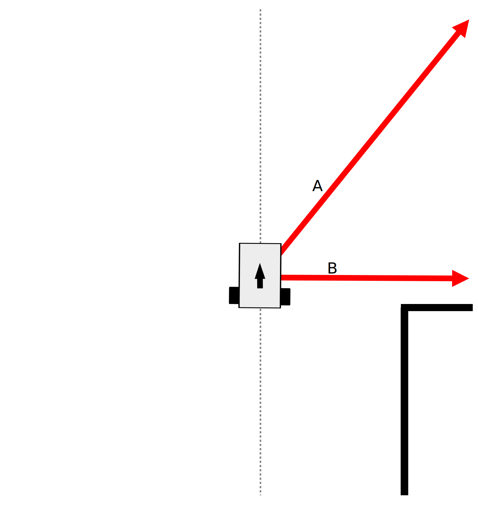

# S4 — Seguimiento de pared

<blockquote><a rel="cc:attributionURL" property="dct:title" href="https://github.com/Albert-Alvarez/ros-gopigo3)">S4 - Seguimiento de pared</a> por <a rel="cc:attributionURL dct:creator" property="cc:attributionName" href="https://thealbert.dev/">Albert Álvarez Carulla</a> se distribuye bajo una <a rel="license" href="https://creativecommons.org/licenses/by-nd/4.0/deed.es">Licencia Creative Commons Atribución-SinDerivadas 4.0 Internacional (CC BY-ND 4.0)</a>.<br /></a></blockquote>

# Video de demostración

Por si os sirve de ayuda, este demostración se realizó con los siguientes parámetros (más adelente tenéis la descripción de cada uno). Haz click en la imagen para ir al video.

[](http://www.youtube.com/watch?v=KQ6LOi9Uig4 "Seguidor de línea con GoPiGo3 y ROS")

- kp: 5
- θ: 50
- L: 0.3
- Dr: 0.175
- vForward: 0.04

# Implementación de un seguimiento de pared

## Sacudamos el polvo a los Schaums

Pues sí. Vamos a desempolvar nuestro Schaums ya que vamos a hacer un poco de trigonometría. Nada exagerado: senos, cosenos y tangentes. Vamos a empezar con la imagen de más abajo. Lo que queremos es mantener el robot a una distancia de referencia `Dr` de la pared. Para ello, mediremos la distancia "instantánea"  `Di` (más tarde veremos el porqué le llamamos "instantánea") y controlaremos el robot para que esta sea igual a `Dr`. Para obtener la distancia `Di` utilizaremos dos mediciones con el láser. Una medida, que identificaremos como `B`, realizada a 90º respecto la dirección del robot y otra medida, que identificaremos como `A`, a un ángulo `θ` de la medición `B`. 

<p align="center">
<a href="assets/S4/imgs/Instant distance.svg" target="_blank">

</a>
</p>

Con la medida `B`, se puede obtener las distancia `Di`.

<p align="center">

</p>

Pero, como veis, nos falta el ángulo `α`. Este ángulo α es el mismo ángulo que se forma en el triangulo creado por las longitudes `Y` y `X`. ¡Vamos a encontrarlo!

<p align="center">

</p>

<p align="center">

</p>

<p align="center">

</p>

Por lo tanto, tenemos que el ángulo `α` es:

<p align="center">

</p>

No está mal... Hemos sobrevivido. Ahora vamos a mejorarlo un poco y para obtener una respuesta suave del robot, no vamos a mirar la distancia instantánea, sino la distancia futura `Df` que tendrá el robot si avanza con su orientación actual una distancia `L`. Esta distancia le llamaremos distancia de proyección.

> Es el equivalente a ir en bicicleta y mirar hacia adelante y no ir mirando la rueda. ¡Hacer lo último garantiza castañazo seguro!

Pues ese escenario seria el de la imagen anterior.

<p align="center">
<a href="assets/S4/imgs/Future distance.svg" target="_blank">

</a>
</p>

Tenemos que `Df` es igual a:

<p align="center">

</p>

Y `Z` la obtenemos a partir de `L` y `α`.

<p align="center">

</p>

Por lo tanto, ya para acabar, tenemos que la distancia futura `Df` es igual a:

<p align="center">

</p>

## Posibles escenarios durante el seguimiento de pared

Esta aproximación va muy bien para paredes cóncavas, pero en giros convexos no se puede utilizar esta aproximación directamente. Veamos que escenarios nos encontramos durante un giro convexo y cómo podemos operar en estas situaciones.

> Siguiendo la pared de nuestra derecha, un giro convexo es un giro de la pared hacia la derecha. Siguiendo la pared de nuestra izquierda es justo al contrario.

En la primera imagen tenemos el caso "normal" o `FOLLOWING_WALL` en el que el robot tiene la pared a su lado y no hay ningún problema. Poco que comentar.

<p align="center">
<a href="assets/S4/imgs/Following wall I..svg" target="_blank">

</a>
</p>

En este segundo escenario (estado `APPROACHING_CORNER`) es cuando la cosa se complica. El robot pierde de vista la pared, que gira abruptamente hacia la derecha, y pierde su seguimiento durante la medición de `A`. ¿Qué podemos hacer? Pues seguiremos en línea recta. ¿Hasta cuándo?

<p align="center">
<a href="assets/S4/imgs/Approaching corner.svg" target="_blank">

</a>
</p>

Hasta que perdamos de vista la pared en el punto `B`. ¿Por qué? Porqué no podemos girar inmediatamente al perder de vista la pared en el punto `A`. Si hiciéramos eso, chocaríamos contra la pared puesto que la medición `A` mira más adelante de donde el robot se encuentra. Hay que esperar a que el robot llegue a la esquina; y eso sucede cuando no detectamos pared en el punto `B`.

<p align="center">
<a href="assets/S4/imgs/Turning.svg" target="_blank">

</a>
</p>

Llegados a la esquina, empezaremos a girar hacia la derecha (estado `TURNING`) con un radio igual a la distancia de referencia `Dr`. Y lo haremos hasta que volvamos a encontrar pared en el punto `A`. 

<p align="center">
<a href="assets/S4/imgs/Approaching wall.svg" target="_blank">

</a>
</p>

Cuando encontremos la pared en el punto `A`, no podemos iniciar el seguimiento de pared inmediatamente. Primero debemos asegurarnos que tenemos localizada la pared en el punto `B`. Este es el estado `APPROACHING_WALL`.

<p align="center">
<a href="assets/S4/imgs/Following wall II.svg" target="_blank">

</a>
</p>

Hecho esto último, ahora si que podemos volver a seguir la pared *like a boss*.

## Máquina de estados

Todo esto proceso entre escenarios queda representado en el siguiente diagrama de máquina de estados.

<p align="center">
<a href="assets/S4/imgs/State machine.svg" target="_blank">

</a>
</p>

## Diagrama de flujo de la función <code>__callbackLaser</code>

Y también tenéis, a continuación, el diagrama de flujo de la función que se ejecuta cada vez que se recibe un mensaje del LIDAR (`__callbackLaser`).

<p align="center">
<a href="assets/S4/imgs/Callback flow diagram.svg" target="_blank">

</a>
</p>


# Código de partida y tareas

A continuación, os dejo el esqueleto del archivo python que controlará nuestro robot para que siga una pared. Este archivo implementa el cálculo del siguiente estado y tiene casi implementado las salidas de cada no de ellos. Deberéis de realizar dos acciones en este archivo:

1. Sustituir las distancias umbral de 0 m en el cálculo del siguiente estado con las distancias umbral que consideréis convenientes. Esto es, las distancias para las cuales consideréis que hay o no una pared. Puesto que deberéis de hacer pruebas para ajustar distancias, podéis añadir los parámetros que consideréis oportunos de cara a poder modificarlos durante el lanzamiento del *launch file* correspondiente y así poder agilizar las pruebas.
2. Implementar la parte de seguimiento de pared (estado `FOLLOWING_WALL`) . Deberéis de calcular la distancia futura, implementar un control proporcional y aplicar la velocidad angular y lineal en consonancia.

En el archivo encontraréis dos comentarios `TODO` que os indican dónde debéis de añadir el código correspondiente de las acciones citadas anteriormente.

> El siguiente archivo sirve solo como guía/ayuda. Sois libres de modificarlo con total libertad con tal de lograr los objetivos del proyecto o mejorar el rendimiento del algoritmo.

```python
#!/usr/bin/env python

import rospy
import numpy as np
from sensor_msgs.msg import LaserScan
from geometry_msgs.msg import Twist
from std_msgs.msg import Float32

class WallFollower:

    def __init__(self):
        """Inicializa las propiedades del nodo y configura los topics a publicar y suscribirse."""

        rospy.init_node("wall_follower_controller", anonymous=False)

        # Propiedades ingresadas con parametros
        self.__kp = rospy.get_param("~kp", 0)
        self.__Dr = rospy.get_param("~distance_reference", 0)
        self.__L = rospy.get_param("~lookahead_distance", 0)
        self.__theta = np.deg2rad(rospy.get_param("~theta", 0))
        self.__vForward = rospy.get_param("~forward_speed", 0)

        # Propiedades sin parametros
        self.__Df = 0
        self.__A = 0
        self.__B = 0

        # Estados disponibles (para mejorar legibilidad)
        self.__state_FOLLOWING_WALL = 0
        self.__state_APPROACHING_CORNER = 1
        self.__state_TUNRING = 2
        self.__state_APPROACHING_WALL = 3

        self.__state = self.__state_FOLLOWING_WALL

        # Propiedades secundarias

        # Tenemos operando dos versiones de Lidar que devuelven 360 0 720 puntos.
        # Para que el codigo sea compatible con cualquiera de los dos, aplicaremos
        # este factor de correccion en los angulos/indices de scan.ranges.
        # Se debe de calcular en la primera ejecucion de __callbackLaser(). Esta
        # variable sirve para asegurar que solo se ejecuta este calculo del
        # factor de correccion una sola vez.
        self.__isScanRangesLengthCorrectionFactorCalculated = False
        self.__scanRangesLengthCorrectionFactor = 1

        # Definicion del mensaje
        self.__msg = Twist()
        self.__msg.linear.x = 0
        self.__msg.angular.z = 0

        # Configuracion del topic a publicar
        self.__cmdVel = rospy.Publisher("/cmd_vel", Twist, queue_size=10)

        # Suscripcion a topic
        rospy.Subscriber("/scan", LaserScan, self.__callbackLaser)

        # Configuracions del metodo a ejecutar cuando se detenga el nodo
        rospy.on_shutdown(self.__shutdown)

    def start(self):
        """Inicia la operacion del nodo."""
        rospy.spin()

    def __callbackLaser(self, scan):
        """Funcion ejecutada cada vez que se recibe un mensaje en /scan."""

        # En la primera ejecucion, calculamos el factor de correcion
        if not self.__isScanRangesLengthCorrectionFactorCalculated:
            self.__scanRangesLengthCorrectionFactor = int(
                len(scan.ranges) / 360)
            self.__isScanRangesLengthCorrectionFactorCalculated = True

        # Obtenemos las mediciones de A y B y las guardamos en variables locales
        A = scan.ranges[int((-90 + self.__unWrapAngle(self.__theta))
                            * self.__scanRangesLengthCorrectionFactor)]
        B = scan.ranges[self.__unWrapAngle(-90) *
                        self.__scanRangesLengthCorrectionFactor]

        # Si el valor leido de A no es NaN ni infinito y da entre 0.1 y 16 m (limites del Lidar),
        # actualizamos la propiedad self.__A con el nuevo valor
        if np.isfinite(A) and 0.1 <= A <= 16:
            self.__A = A

        # Idem con B
        if np.isfinite(B) and 0.1 <= B <= 16:
            self.__B = B

        # Calculamos el siguiente estado
        ##################################################################
        # TODO: Sustituir las distancias umbral igual a 0 por las que        
        # considereis oportuno
        ##################################################################
        if not self.__isThereAWall(self.__A, 0) and \
           self.__state == self.__state_FOLLOWING_WALL:

            self.__state = self.__state_APPROACHING_CORNER

        elif not self.__isThereAWall(self.__B, 0) and \
                self.__state == self.__state_APPROACHING_CORNER:

            self.__state = self.__state_TUNRING

        elif self.__isThereAWall(self.__A, 0) and \
                self.__state == self.__state_TUNRING:

            self.__state = self.__state_APPROACHING_WALL

        elif self.__isThereAWall(self.__B, 0) and \
                self.__state == self.__state_APPROACHING_WALL:

            self.__state = self.__state_FOLLOWING_WALL

        # Actuamos en funcion del estado
        # Si estamos aproximandonos a la pared o a la esquina
        if self.__state in \
           {self.__state_APPROACHING_CORNER, self.__state_APPROACHING_WALL}:

            self.__msg.angular.z = 0
            self.__msg.linear.x = self.__vForward

        # Estamos girando
        elif self.__state == self.__state_TUNRING:

            self.__msg.angular.z = -self.__vForward / self.__Dr
            self.__msg.linear.x = self.__vForward

        elif self.__state == self.__state_FOLLOWING_WALL:
            ############################################################
            # TODO: Implementar control P para el seguimiento de pared
            ############################################################

        # Publicamos el mensaje
        self.__cmdVel.publish(self.__msg)

    def __isThereAWall(self, valueMeasured, thresholdValue):
        """Indica si hay una pared en o no a una distancia indicada."""

        return valueMeasured < thresholdValue

    def __wrapAngle(self, angle):
        """Devuelve un angulo de -180 a 180."""

        if 0 <= angle <= 180:
            return angle
        else:
            return angle - 360

    def __unWrapAngle(self, angle):
        """Devuelve un angulo de 0 a 360."""

        if angle < 0:
            return angle + 360
        else:
            return angle

    def __shutdown(self):
        """Para el robot antes de detener el nodo."""

        self.__msg.linear.x = 0
        self.__msg.angular.z = 0
        self.__cmdVel.publish(self.__msg)


if __name__ == '__main__':
    try:
        wf = WallFollower()
        wf.start()
    except rospy.ROSInterruptException:
        pass

```