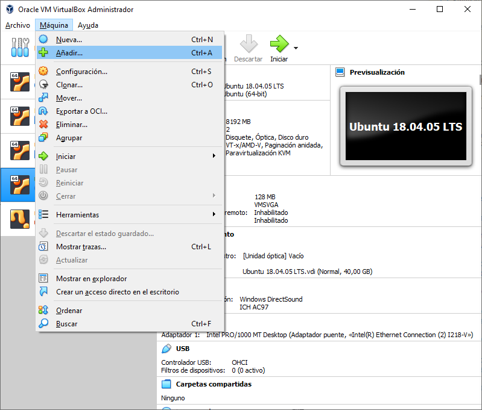
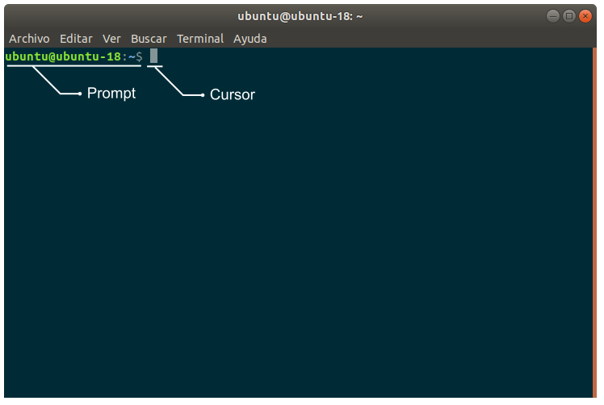

# S1 — Configuración de nuestro ordenador, operaciones básicas en Linux y super-simulación de una tortuga

<blockquote><a rel="cc:attributionURL" property="dct:title" href="[https://github.com/Albert-Alvarez/ros-con-gopigo3](https://github.com/Albert-Alvarez/ros-con-gopigo3)">S1 - Configuración de nuestro ordenador, operaciones básicas en Linux y super-simulación de una tortuga</a> por <a rel="cc:attributionURL dct:creator" property="cc:attributionName" href="[https://thealbert.dev/](https://thealbert.dev/)">Albert Álvarez Carulla</a> se distribuye bajo una <a rel="license" href="[https://creativecommons.org/licenses/by-nd/4.0/deed.es](https://creativecommons.org/licenses/by-nd/4.0/deed.es)">Licencia Creative Commons Atribución-SinDerivadas 4.0 Internacional (CC BY-ND 4.0)</a>.<br /></a></blockquote>

Vamos a empezar por el principio e **instalaremos** todo lo necesario para poder trabajar con ROS.  Para tu inmensa suerte 😎, utilizaremos una **máquina virtual** previamente configurada con todo el *software* ya instalado; por lo que la instalación será sencilla.

Una vez tengamos todo instalado, aprenderemos a realizar **operaciones básicas con el terminal de Linux** (crear y entrar en un directorio, eliminarlo, cambiarle el propietario, permisos, etc.), por si no has utilizado nunca Linux o su terminal (¡mal hecho!). Todo esto lo necesitaremos cuando trabajemos con ROS.

Por último, **ejecutaremos un pequeño proyecto en ROS** para verlo en ejecución y ver que **todo está instalado correctamente** y entendemos **qué es lo que está haciendo ROS** ante nuestros ojos.

# Objetivos

- Tener listo nuestro PC para poder desarrollar proyectos en ROS.
- Conocer y saber usar las operaciones básicas con el terminal de Linux:
    - Crear una carpeta.
    - Rutas absolutas y relativas.
    - Entrar a una carpeta.
    - Cambiar el nombre a una carpeta o archivo.
    - Eliminar una carpeta o archivo.
    - Listar carpetas y archivos.
    - Cambiar el usuario y/o grupo propietario de una carpeta o archivo.
    - Cambiar los permisos de una carpeta o archivo.
    - Encontrar la ruta en la que nos encontramos actualmente.
    - Uso de caracteres especiales: `~`, `.`, `..`.
    - Entender la función del comando `source`.
    - Trucos y atajos útiles.
- Iniciar el master de una red ROS.
- Ejecutar un nodo en ROS.
- Ver los *topics* disponibles, sus tipos y mensajes publicados.
- Visualizar una red ROS con `rqt_graph`.

# Procedimiento

## Instalación de la máquina virtual

### Instalación de VirtualBox

Pues lo dicho en la intro, lo que vamos a hacer es descargarnos un *software* de virtualización y en él añadiremos una máquina virtual (VM) en la que ya tendrás todo el *software* necesario para llevar a cabos las sesiones de ROS. Además, como es la VM que he utilizado para preparar estas prácticas, el correcto funcionamiento de la misma está garantizado 💯

El *software* de virtualización que utilizaremos se llama VirtualBox de Oracle. Algo que no he comentado es que es *Open Source*, gratuito y además está disponible tanto en Windows, MacOS y Linux, por lo que el sistema operativo (OS) de tu dispositivo no es una excusa 😎

Lo puedes descargar desde el siguiente [enlace](https://www.virtualbox.org/).

No voy a dar más detalles de como instalarlo. Simplemente, aplica el algoritmo <kdb>Siguiente</kbd>, <kbd>Siguiente</kbd>, <kbd>Siguiente</kbd>..., y, por último, <kbd>Finalizar</kbd>.

### Añadir VM

Una vez instalada, descárgate la VM del siguiente [enlace](https://ubarcelona-my.sharepoint.com/:f:/g/personal/albertalvarez_ub_edu/EijwQPQqCC1Ln4kcRlCj-ywB96NFmOAq2NoInnZxiuu9Dg).

Descárgate la carpeta entera haciendo clic en "Descargar" arriba del todo de la página (descomprime el `.zip`) y guárdala, no sé, en tu Escritorio o allí donde estimes oportuno (pero que te acuerdes de dónde está 😑).

Para añadir la VM descargada a tu VirtualBox, abre este último y después clica en el menú `Máquina  > Añadir...`. En la ventana emergente que aparecerá, ves a la carpeta que acabas de descargar y escoge el archivo con extensión `.vbox` que hay en ella.



### Configurar VM

Hecho esto, podrías abrir ya la VM, pero esta, puesto que la he creado yo, tiene asignada unos recursos acordes a la configuración de mi super-ordenador de la NASA. Por ello, hacemos clic derecho a la máquina recién añadida (estará a la izquierda con el nombre de Ubuntu 18.04.05 LTS (Clean)) y clicamos en `Configuración`.

En la ventana de configuración, nos vamos a `Sistema` (menú lateral de la izquierda). Ahí seleccionamos una memoria base acorde a nuestro ordenador. Recomiendo siempre configurar un valor dentro del rango verde. Si te pasas, se te puede *crashear* el ordenador. Por ejemplo, un valor a 3/4 del rango verde estaría bien.

Luego, en la pestaña `Procesador`, lo mismo, configuramos un número de procesadores que esté alrededor de los 3/4 del rango en verde.

Por último, nos vamos a `Red` en la barra lateral izquierda y nos aseguramos que en el segundo desplegable (donde pone `Nombre`) tenemos seleccionado el adaptador que utiliza nuestro ordenador para conectarse a internet (normalmente, el primero disponible, pero no tiene porque ser así). Finalmente, en la misma pestaña, desplegamos "Avanzadas" y, al lado de la dirección MAC, clicamos al botón de su derecha para refrescar esta dirección.

Aceptamos y listos 😉

### Arrancar la VM

Simple: doble clic a la VM en el menú de la izquierda y se abrirá una ventana nueva donde arrancará nuestra VM. Nuestra VM tiene como OS Ubuntu 18.04. ROS trabaja solo en Linux.

La versión 2.0 de ROS está pensada para trabajar también en Windows, pero no la usamos porque está recién salida del horno y se están depurando errores y migrando *packages* de la versión 1.0 a la 2.0).

En ROS, como en Linux, existen diferentes distribuciones. ¿Qué son las distribuciones? Básicamente, al ser de código abierto, cada uno adapta ROS a sus intereses y comodidades y después puede hacerlo accesible públicamente con estas modificaciones, por lo que se crean 200.000 variantes o distribuciones (una de las cosas buenas/malas del código libre). Pero en el fondo, todas las distribuciones hacen lo mismo salvo particularidades. En nuestro caso, utilizamos [ROS Melodic](http://wiki.ros.org/melodic).

Por otro lado, todas las versiones de ROS se pueden compilar y ejecutar en diferentes distribuciones y versiones de Linux, pero la [organización de ROS](https://www.ros.org/) solo ofrece repositorios con ROS pre-compilado a ciertas distribuciones y versiones de Linux. Bajar el código de ROS y compilarlo llevar horas y mil errores... Por lo que escoger una distribución y versión de Linux con paquetes pre-compilados disponibles es la mejor opción (muuucho más rápido de instalar y sin fallos). En este caso, ROS Melodic funciona (ofrece paquetes pre-compilados) para Ubuntu 18.04.

Todo esto para que sepas por qué Linux, por qué Ubuntu y por qué la versión 18.04.

Una vez arrancada la máquina, nos pedirá hacer login. Los datos de la cuenta de usuario son:

- Usuario: ubuntu
- Contraseña: ubuntu

Acuérdate, sobretodo, de la contraseña ya que el terminal te la estará pidiendo constantemente cuando quieras realizar acciones con permisos de administrador.

Por último, para asegurarte que puede ver la VM correctamente cuando maximizas la ventana o la pongas en pantalla completa, y que puedes copiar y pegar texto entre la VM y tu ordenador, asegúrate de tener la siguiente configuración.


Los usuarios de Macbook con pantalla Retina, aseguraros de instalar la aplicación [EasyRes](https://apps.apple.com/es/app/easyres/id688211836) y desactivar Retina para que os vaya fluida la VM.

## Operaciones básicas con el terminal

Ahora que ya tenemos la VM corriendo, aquí está, aquí tienes, tu peor pesadilla: el terminal 👨‍💻 

Venga va, no le tengas tanto pavor. Las acciones que realizaremos en el terminal serán muy **sencillas**. Además, el día de mañana seguro que **la tendrás que utilizar en tu trabajo**, así que aprovecha y empieza a darle caña y a aprender cómo funciona esta herramienta que te permitirá ir mucho más rápido y **aumentar tu productividad**.

Mi recomendación es que **pruebes los comandos** de este documento (a andar se aprende andando), pero también que te guardes esta página en favoritos para que tengas una **chuleta** a la cual acudir cuando quieras hacer algo en el terminal durante las prácticas y no te acuerdes cómo se hacía.

Vamos a ello.

### Abrir un terminal e identificar sus partes

Para abrir un terminal o bien usamos el atajo <kbd>CTRL</kbd>+<kbd>ALT</kbd>+<kbd>T</kbd> o bien vamos al icono de la esquina inferior izquierda de la pantalla y escribimos "terminal".

Al abrirlo, nos aparecerá la siguiente ventana.



En ella identificamos dos partes principales: el ***prompt*** y el **cursor**.

El primero nos da información sobre el terminal. Primeramente nos indica el **usuario** con el que se está ejecutando el terminal y con el cuál se ejecutarán los comandos que introduzcamos. A continuación, después del @, aparece el **nombre de ordenador** o ***hostname***. Nuestra VM tiene configurado como nombre `ubuntu-18`. Seguidamente, después de los dos puntos `:`, aparece la **ruta o *path*** en el que se encuentra el terminal en ese instante. En la imagen, el terminal se encuentra actualmente en la ruta `~`, que es la ruta al directorio *home* (`/home/ubuntu/`) de nuestro usuario. Seguidamente, aparece el **símbolo dólar** `$` que nos indica que estamos con un usuario normal (no con el administrador o *root*).

Después del símbolo del dólar aparece el **cursor**, donde sencillamente **introduciremos los comandos** que queremos ejecutar y pulsaremos <kbd>ENTER</kbd> para hacerlo.

Si en cualquier momento veis que el símbolo del dólar ha cambiado a `#`, es que habéis hecho algo que no debíais 😅 Simplemente, ejecutad el siguiente comando en el terminal:

```bash
exit
```

### Encontrar la ruta en la que nos encontramos

A veces necesitamos **saber la ruta completa en la que estamos** y no la relativa a nuestro *home* (que es la que aparece en el *prompt*). Para ello, ejecutamos el siguiente comando:

```bash
pwd
```

El terminal nos devolverá la ruta absoluta en la que se encuentra el terminal.


### Crear una carpeta

Para crear una carpeta utilizamos el comando `[mkdir](https://linux.die.net/man/1/mkdir)` (*make directory*). A continuación del comando, escribimos el nombre de la carpeta crear. La carpeta se nos creará en la carpeta en la que se encuentre el terminal en ese instante.

```bash
mkdir nombre_de_tu_carpeta
```

También puedes crear una carpeta en un lugar distinto indicando una ruta absoluta en lugar de una relativa. Por ejemplo:

```bash
mkdir /home/ubuntu/Escritorio/nombre_de_tu_otra_nueva_carpeta
```

Habrás notado que no pongo espacios en los nombres de las carpetas que he creado. Es recomendable no poner a los archivos/carpetas espacios en blanco ni caracteres no ingleses como "Ñ" , "Ç" o acentos. A muchos programas no les gusta, como seguramente habéis podido comprobar todos aquellos que guardáis las cosas del grado en una carpeta llamada Grau d'Enginyeria Biomèdica. Grau d'Enginyeria Electrònica o Grau d'Enginyeria Informàtica.

### Rutas absolutas y relativas

Existen dos maneras de [indicar rutas o *paths*](https://linux.die.net/Linux-CLI/c2690.htm): con un *path* [relativo](https://es.wikipedia.org/wiki/Ruta_(inform%C3%A1tica)#Ruta_relativa) o con *path* [absoluto](https://es.wikipedia.org/wiki/Ruta_(inform%C3%A1tica)#Ruta_absoluta). El primero indica una ruta tomando que partida una carpeta determinada. El segundo indica una ruta a partir del [directorio raíz](https://es.wikipedia.org/wiki/Directorio_ra%C3%ADz#:~:text=En%20inform%C3%A1tica%2C%20el%20directorio%20ra%C3%ADz,totalidad%20de%20un%20solo%20disco.) `/`.

Por ejemplo, si estoy en la carpeta `/home/ubuntu/Escritorio/carpeta_1` y quiero hacer referencia a una carpeta llamada `carpeta_3` que está dentro de una carpeta llamada `carpeta_2` que a su vez está dentro de `/home/ubuntu/Escritorio/carpeta_1` , puedo hacerlo con un *path* relativo `carpeta_2/carpeta_3` o con un *path* absoluto `/home/ubuntu/Escritorio/carpeta_1/carpeta_2/carpeta_3`.

Estructura de directorios del ejemplo para los despistados.

```
/
└── home
    └── ubuntu
        └── Escritorio
            └── carpeta_1
                └── carpeta_2
                    └── carpeta_3
```

### Entrar a una carpeta

Para entrar a una carpeta, simplemente `[cd](https://linux.die.net/Linux-CLI/using-filesystem.html)` (*change directory*) y a continuación el *path*, relativo o absoluto, a la carpeta a la que queremos ir.

```bash
cd ruta_a_la_carpeta
```

### Caracteres especiales

Te habrás fijado que cuando hemos hablado del *prompt* ha aprecido un carácter tal como este `~`. Este carácter es la tilde y es un [carácter especial](https://linux.die.net/Bash-Beginners-Guide/sect_03_04.html). Este carácter es interpretado por el terminal como la ruta al directorio *home* de tu usuario. Es decir, al ejecutar un comando que contiene `~`, el terminal "sustituye" este carácter por la ruta `/home/ubuntu` (en nuestro caso). De este modo, podemos utilizar el carácter `~` para indicar rutas relativas a nuestro directorio *home*. Por ejemplo, podemos ir la carpeta `/home/ubuntu/carpeta_1/carpeta_2` mediante el comando:

```bash
cd ~/carpeta_1/carpeta_2
```

Esto es lo mismo que:

```bash
cd /home/ubuntu/carpeta_1/carpeta_2
```

Pero la tilde no es el único carácter especial. También esta el punto `.` el cual es lo mismo que la ruta actual. Es decir, si, por ejemplo, estamos actualmente en nuestra carpeta *home*, podemos crear una carpeta en ella de 4 modos distintos:

```bash
mkdir nombre_carpeta
```

```bash
mkdir ./nombre_carpeta
```

```bash
mkdir ~/nombre_carpeta
```

```bash
mkdir /home/ubuntu/nombre_carpeta
```

Otro carácter especial son dos puntos seguidos `..`. Este carácter es la ruta a la carpeta inmediatamente superior a la que nos encontremos. Por ejemplo, si estamos en la carpeta `/home/ubuntu/carpeta_1/carpeta_2` y queremos subir a la carpeta `/home/ubuntu/carpeta_1`, podemos hacer:

```bash
cd ..
```

Si en lugar de un nivel, queremos subir dos:

```bash
cd ../..
```

### Cambiar el nombre de una carpeta (o archivo)

No existe un comando para renombrar un archivo o carpeta. En su lugar, utilizamos el comando `[mv](https://linux.die.net/man/1/mv)` (*move*) para "mover" un archivo o carpeta "de una localización a otra" a la vez que aprovechamos para cambiar el nombre. Para renombrar la carpeta `carpeta_1` a `carpeta_2`, haríamos:

```bash
mv carpeta_1 carpeta_2
```

### Eliminar un archivo

Para eliminar un archivo, utilizamos el comando `[rm](https://linux.die.net/man/1/rm)` (*remove*). Para eliminar el archivo `mi_archivo.txt`, ejecutamos:

```bash
rm mi_archivo.txt
```

Podemos añadir el parámetro `-f` para forzar la eliminación si en un primer intento no nos dejan:

```bash
rm -f mi_archivo.txt
```

### Eliminar una carpeta

Para una carpeta se utiliza el mismo comando, la diferencia está en que al eliminar una carpeta también hay que eliminar todo su contenido. Por ello, debemos de ejecutar el comando `rm` de manera recursiva. Esto lo hacemos con el parámetro `-r`:

```bash
rm -r carpeta_1
```

Y para forzar la eliminación:

```bash
rm -rf carpeta_1
```

### Listar carpetas y archivos

Existe un comando que lista todos los archivos en una carpeta. Ese comando es `[ls](https://linux.die.net/man/1/ls)` (*list files/directories*). Si lo ejecutamos en nuestro *home*:

```bash
ls
```

Obtendremos un listado de los archivos y carpeta en la ruta actual.


Ahora ejecutaremos el mismo comando, añadiendo el parámetro o *switch* `-l`. Es decir:

```bash
ls -l
```

Ahora el comando nos sigue dando un listado de los archivos, pero además adjunta una serie de datos referentes a cada uno de los archivos.


Vamos por partes.

Cada fila del listado corresponde a un archivo o carpeta. En total, hay ocho columnas separadas por un espacio o tabulación.

- La primera columna es el primer guion que aparece en la fila. Ese guion indica que se trata de un archivo. Si fuera un directorio, habría una `d`. Y si fuera un enlace (lo más parecido, sin ser lo mismo, serían los accesos directos en Windows), habría una `l`.
- La segunda columna son los 6 caracteres siguientes. Esos caracteres toman los valores de `-` (*none*), `r` (*read*), `w` (*write*) y `x` (*execute*). Esta columna muestra los [permisos](https://linux.die.net/Linux-CLI/file-permissions.html) para el usuario y grupo propietarios del archivo/directorio y los permisos para el resto de usuarios.
Los primeros tres caracteres indican los permisos del usuario propietario del archivo. Así pues, si el usuario propietario tiene permisos de solo lectura, los tres primeros caracteres serían `r--`. Si tuviese solo permisos de escritura, serían `-w-`. Si tuviera solo permisos de ejecución, sería `--x`. Los permisos también pueden ser combinados, de tal modo que si el usuario propietario tuviera todos los permisos, sería `rwx`.
Los tres siguientes caracteres siguen la misma lógica y se refieren a los permisos del grupo propietario del archivo/directorio.
Los últimos tres caracteres son los permisos del resto de usuarios.
Tomando el ejemplo de la captura, los permisos de la carpeta `Descargas` son:
    - Usuario propietario: Lectura (Sí), Escritura (Sí), Ejecución (Sí).
    - Grupo propietario: Lectura (Sí), Escritura (No), Ejecución (Sí).
    - Resto de usuarios: Lectura (Sí), Escritura (No), Ejecución (Sí).
- La siguiente columna es el número de *hard links* al archivo. Nada que nos interese.
- La cuarta columna es el tamaño del archivo en bytes.
- La quinta columna es el usuario propietario. En el ejemplo, somos nosotros, el usuario `ubuntu`.
- La sexta columna es el grupo propietario. En el ejemplo, el grupo es `ubuntu`. Ojo, hay un grupo que se llama `ubuntu`. Este `ubuntu` no es el usuario, sino el grupo.
- La penúltima columna es la fecha de modificación del archivo.
- Por último, aparece el nombre del archivo/directorio.

### Cambiar los permisos de una carpeta (o archivo)

Ahora que ya conocemos un poco la magia negra que hay detrás de Linux, vamos a ver cómo dar permisos. Para ello utilizamos el comando `[chmod](https://linux.die.net/man/1/chmod)` (*change mode*). Utilizaríamos el comando del siguiente modo

```bash
sudo chmod u=r+w+x Descargas
```

Vamos a desengranar el comando. Primeramente, con `[sudo](https://linux.die.net/man/8/sudo)` ejecutamos el comando con permisos de administrador. Suele ser común utilizar permisos de administrador para configurar los permisos. En este caso no nos haría falta puesto que somos el usuario propietario del archivo y tenemos permisos para modificarlo, pero ante la duda, usad `sudo` cuando cambiéis permisos.

No es una buena práctica lo que os acabo de decir, pero suele ser común acabar haciéndolo así. Lo que nunca debéis de hacer es dar permisos a todo el mundo porque sí. ¡Eso sí es una mala práctica que se castiga con cadena perpetua!

Luego utilizamos el comando `chmod` que acompañamos con los permisos que queremos configurar. En este caso, decimos que el *user* propietario tenga permisos de lectura, escritura y ejecución. Es decir, `u=r+w+x` (`u` de *user*, para los despistados) . Si fuéramos a dar permisos al grupo, sería `g=r+w+x` (`g` = *group*). Y si fuéramos a dar permisos al resto de usuarios, haríamos `o=r+w+x` (`o` = *others*). Existe otro modo para no explicitar los tres tipos de permisos. Sería con el comando

```bash
sudo chmod u+x Descargas
```

Con esta instrucción (fijaros que hemos cambiado el `=` por un `+`) estamos dando permisos de ejecución al usuario propietario sin modificar los permisos de lectura y escritura del archivo/directorio.

Con esto, ya hemos modificado los permisos (puedes usar `ls -l` para comprobarlo).

### Cambiar el usuario y/o grupo propietario de una carpeta (o archivo)

Con el comando `[chown](https://linux.die.net/man/1/chown)` (*change owner*) cambiamos tanto el usuario como el grupo. Para cambiar el usuario y grupo propietario de la carpeta `Descargas` a `Fulanito` y `Menganito`, respectivamente, utilizaríamos:

```bash
sudo chown Fulanito:Menganito Descargas
```

### Scripts y el comando source

Te vas aaaaaaaaaaa hinchar a ejecutar el comando `source`; pero antes de verlo, veamos que es un *script*.

Un *script*, básicamente, es un archivo que utilizamos para automatizar tareas en el terminal. Es decir, es un archivo de texto que recoge línea a línea cada comando que introduciríamos a mano en el terminal para llevar a cabo una acción.

Para ejecutar este *script* en el terminal, utilizamos el comando `source`.

Imagínate que, siempre que empiezas a trabajar, necesitas (por que tu cuerpo lo pide, no hay otra explicación posible... 😅), crear una carpeta, cambiarle los permisos, entrar en ella, crear otra carpeta, y luego subir para mover todo a una carpeta distinta (un ejemplo super ilógico... lo sé... pero es lo que sabemos hacer ahora mismo). Todo esto serían los siguientes comandos:

```bash
mkdir carpeta_1
```

```bash
chmod u=r+w+x carpeta_1
```

```bash
cd carpeta_1
```

```bash
mkdir carpeta_2
```

```bash
cd ..
```

```bash
mv carpeta_1 ~/Escritorio/carpeta_3
```

Todos estos comandos podríamos añadirlos a un archivo `script_ilogico.sh` que tendría la siguiente pinta:

```bash
#!/bin/bash

mkdir carpeta_1
chmod u=r+w+x carpeta_1
cd carpeta_1
mkdir carpeta_2
cd ..
mv carpeta_1 ~/Escritorio/carpeta_3
```

Si ejecutáramos este archivo con el comando `source`:

```bash
source script_ilogico.sh
```

Estaríamos haciendo lo mismo que habiendo introducido todos los comandos antes introducidos manualmente. 

Para poder ejecutar *scripts*, debemos de tener habilitados permisos de ejecución. Así que antes de ejecutar nuestro recién creado `script_ilogico.sh`, deberíamos de haber hecho:

```bash
sudo chmod +x script_ilogico.sh
```

Esto son los *scripts* y esto es lo que hace el comando `source`.

### Trucos y atajos útiles

De momento te pongo como truco/atajo el [uso de la tecla <kbd>TAB</kbd>](https://linux.die.net/Linux-CLI/c1195.htm#GENERAL-SHELL-TIPS). Si empiezas a escribir una ruta, nombre de archivo/carpeta o comando y, antes de acabar de escribirlo, pulsas <kbd>TAB</kbd>, el terminal te autocompletará lo que estabas escribiendo si existe alguna coincidencia. ¡Superútil!

También os añado otro: para detener un proceso en el terminal, utilizamos el atajo <kbd>CTRL</kbd>+<kbd>C</kbd>. Este atajo no pararás de usarlo, ¡así que tatúatelo en la piel si hace falta!

## Simulación de una tortuga

Bueno, ahora sí 😤 Vamos a trabajar con ROS. En esta primera toma de contacto con ROS, vamos a ejecutar una serie de nodos que ya vienen instalados por defecto. En este ejemplo, lanzaremos un "mini-juego" en el que aparece una tortuga la cual controlaremos mediante las flechas del teclado. Una aplicación muy sencilla que nos permite ver un ROS en funcionamiento. En este ejemplo tendremos tres nodos corriendo: uno llamado turtlesim, otro llamado turtle_teleop_key y el master.

El primero se encarga de simular la tortuga y su desplazamiento en una ventana. Para ello, se suscribirá a un *topic* llamado `/turtle1/cmd_vel` de donde tomará las velocidades que debe de aplicar a la tortuga.

Seguro que te has fijado que los *topics* empiezan con el carácter `/`. No es obligatorio. Esta barra se añade para indicar que es global. Así que cuidado cómo nombras los *topics* en un futuro. Tienes más info [aquí](http://wiki.ros.org/Names).

El segundo nodo, turtle_teleop_key, leerá las pulsaciones de las teclas de nuestro teclado, lo convertirá en velocidades y las publicará en el *topic* `/turtle1/cmd_vel`.

El último nodo es el master simplemente se encarga de registrar los nodos y *topics* para hacerlos disponibles en toda la red de ROS.

### Iniciar el nodo master

Vamos a empezar por iniciar el master. Para ello, ejecutamos el comando:

```bash
roscore
```

Se te quedará el terminal tal que así.


Sin problema. Todo correcto. Este terminal quedará corriendo `roscore` hasta que lo detengamos a mano (o *crashee* por algún motivo). Si queremos pararlo, utilizamos el atajo de teclado <kbd>CTRL</kbd>+<kbd>C</kbd>.

### Ejecutar nodos

Ahora vamos a lanzar los nodos turtlesim y turtle_teleop_key. Puesto que el terminal está actualmente "secuestrado" por el comando `roscore` (el terminal ha quedado inhabilitado hasta que se detenga el proceso), necesitamos abrir un nuevo terminal. Podemos abrir uno nuevo en una pestaña nueva yendo a `Archivo > Pestaña nueva`. En ese nuevo terminal, para lanzar el nodo turtlesim, ejecutamos:

```bash
rosrun turtlesim turtlesim_node
```


Al comando `rosrun` le sigue el nombre del *package* y el nombre del nodo. **Los nodos se agrupan en *packages*.** Seguidamente, podrían ir parámetros que podríamos haber indicado al nodo, pero no ha sido el caso.

Una nueva ventana aparecerá con la tortuguita en cuestión 🐢


Ahora, en un nuevo terminal/pestaña (porque nuevamente se nos queda el terminal bloqueado en el nodo que está corriendo), ejecutamos el siguiente comando para correr el nodo turtle_teleop_key:

```bash
rosrun turtlesim turtle_teleop_key
```

Hecho esto, si en este terminal pulsamos las flechas del teclado, veremos como la tortuga se desplaza a través de la ventana.


El resultado... a ver... espectacular no es 🤣, pero nos servirá para ahora ver qué está haciendo ROS entre bambalinas y acabar de entender cómo opera.

### Ver topics existentes, sus tipos y mensajes publicados

Aquí viene lo importante. Vamos a ver qué *topics* se están publicando, qué mensajes se están enviando a través de ellos y de qué tipo.

El comando a utilizar es `rostopic`. Puesto que tenemos todos los terminales ocupados, nos abrimos una pestaña nueva con un nuevo terminal. En él, escribimos:

```bash
rostopic
```

Si lo escribimos así, sin acompañarlo con nada más, nos listará todas las opciones posibles y para qué sirven. ¡Muy útil!

De todas las opciones, ahora mismo nos quedamos con la opción `rostopic list`. Lo ejecutamos en el terminal:

```bash
rostopic list
```


Como puedes ver, hay más de un *topic*, y no solo el *topic* `/turtle1/cmd_vel` que esperábamos. Los *topics* `/rosout` y `/rosout_agg` son *topics* donde van aparar los logs generados durante la ejecución de ROS (útiles para depurar). El *topic* `/turtle1/cmd_vel` es donde el nodo turtle_teleop_key publica las velocidades que leerá el nodo turtlesim_node. El nodo turtlesim_node publica en el *topic* `/turtle1/color_sensor` el color de fondo de la ventana por la que navega la tortuga. Por último, también publica su actual posición en el *topic* `/turtle1/pose`.

En nuestro caso, vamos a centrarnos en el *topic* `/turtle1/cmd_vel`. Primeramente, vamos a ver de qué tipo es. Para ello, ejecutamos:

```bash
rostopic type /turtle1/cmd_vel
```


Los mensajes publicados en el *topic* `/turtle1/cmd_vel` son del tipo `geometry_msgs/Twist` donde `geometry_msgs` es el nombre del *package* al que pertenece el tipo de mensaje y `Twist` el tipo de mensaje *per se*.

Otro modo de ver el tipo y otra información muy útil como los nodos suscritos a ese *topic* y los que publican en él, es el comando:

```bash
rostopic info /turtle1/cmd_vel
```


Nada que añadir. La información que ofrece el terminal es clara y concisa 🧐

También puede ser interesante en qué consiste el tipo de mensaje utilizado. Para ello:

```bash
rosmsg show geometry_msgs/Twist
```


Y, básicamente, vemos que los mensajes en el *topic* `/turtle1/cmd_vel` consisten en 2 vectores de 3 dimensiones (un vector para indicar la velocidad lineal y otro para la velocidad angular) y que las variables son de tipo `float64`.

Ahora veamos qué se está publicando en este *topic*. Lo podemos ver con el comando:

```bash
rostopic echo /turtle1/cmd_vel
```

...

...

...

Espectacular...

No sale nada... ¿Porqué? Pues porque nadie está publicando ningún mensaje en ese *topic*. En ese *topic* solo publica el nodo turtle_teleop_key al pulsarse las flechas del teclado. Si no pulsas flechas, no se publican velocidades. Para algún mensaje, vuelve al terminal donde se estaba ejecutando turtle_teleop_key y pulsa un par o tres de flechas. Vuelve ahora al último terminal y comprueba como ahora sí aparecen los mensajes que turtle_teleop_key  está publicando en `/turtle1/cmd_vel`.


Pulsa <kbd>CTRL</kbd>+<kbd>C</kbd> para salir del `rostopic echo`.

Por último, con el comando `rostopic` podemos publicar mensajes directamente en un *topic*. Lo hacemos mediante `rostopic pub`:

```bash
rostopic pub /turtle1/cmd_vel geometry_msgs/Twist "linear:
  x: 1.0
  y: 0.0
  z: 0.0
angular:
  x: 0.0
  y: 0.0
  z: 0.0"
```

Tengo un poder sobrenatural. Puedo adivinar tu pensamiento: "¿Donde me vas con semejante comando? ¿En serio pretendes que me sepa esto de memoria?". A lo que yo te digo: no, ni de coña. Aquí es donde viene de fábula utilizar el *tip* del tabulador <kbd>TAB</kbd>. Sigue estos pasos:

1. Escribe `rostopic pub`.
2. A continuación, dejando un espacio, escribe `/tu`. ([Confía en mí.](https://i.ytimg.com/vi/SR7MsVA8xJU/maxresdefault.jpg))
3. Pulsa <kbd>TAB</kbd>. ¡Mágia! Se ha puesto solo `/turle1/`.
4. Ahora, escribe una `cm` y luego <kbd>TAB</kbd>. Ya tenemos el nombre del *topic*.
5. Dejando un espacio y escribe `geo` y después <kbd>TAB</kbd>. Ya tenemos el tipo de mensaje.
6. Ahora, directamente, pulsa otra vez <kbd>TAB</kbd>. El terminal es tan inteligente, que te completa el comando con un mensaje pre-formateado con los valores por defecto (todo 0).
7. Solo queda editar los valores a los deseados y pulsar <kbd>ENTER</kbd>.

¿Has visto? No hace falta saberse todo de memoria (que ni yo me lo sé) y tampoco escribir todo a mano. ¡La tecla <kbd>TAB</kbd> es tu mayor amiga!

Comprueba que, ejecutado el comando, la tortuga se desplaza tal y como esperamos.

Para salir, haz lo que aparece en el terminal.

### Visualización de redes ROS con rqt_graph

Ya queda lo último y será rapidito. Simplemente, utilizar una herramienta para ver gráficamente la composición de la red ROS. Lo haremos con `rqt_graph`.

En el último terminal, ejecuta:

```bash
rqt_graph
```

Te aparecerá una ventana donde podrás ver el diagrama de la red ROS.


Los óvalos corresponden a los nodos y las flechas los *topics*. En esta red tan sencilla no hay nada más que destacar y ya le sacaremos más punta a esta útil herramienta en sesiones venideras 😉

# Reto

Normalmente, después de cada sesión suele haber un mini-reto para utilizar lo visto en la sesión; pero, al ser la primera, hemos tenido que ver mucho contenido de golpe y dedicarle mucho tiempo. Por ello, en esta sesión no hay reto 🥳

# Evaluación

Como entregables a evaluar de esta práctica solo está el **test online previo**.

# Conclusiones


Hombre/mujer... no diría tanto 😅, porque solo hemos visto la punta del iceberg, pero ¡*not bad* todo lo que hemos visto en esta sesión!

En esta sesión hemos preparado nuestro PC para poder hacer nuestros desarrollos en ROS. Hemos aprendido las operaciones básicas con el terminal de Linux. Sí que es cierto que aún no hemos utilizado la gran mayoría, pero te aseguro que se utilizarán todas estas operaciones a lo largo de las sesiones y prefería dejártelo todo agrupadito y ordenadito en un solo documento para que puedas tirar de él a modo chuleta en un futuro 😉

También, importante, hemos visto cómo iniciar el master y como correr nodos ROS.

Por último, hemos visto las entrañas de ROS viendo los *topics* publicados, sus mensajes y tipos, y cómo podemos ver gráficamente la estructura de nuestra red ROS. Herramienta que nos será infinitamente útil cuando más adelante desarrollemos redes más complejas.

De momento lo dejamos aquí, descansa y desconecta que en la próxima sesión veremos cómo hacer nuestros propios *packages*/nodos en ROS.

...

¿Te acuerdas de cómo programar en python?
